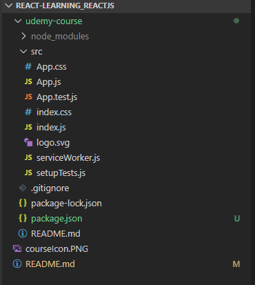
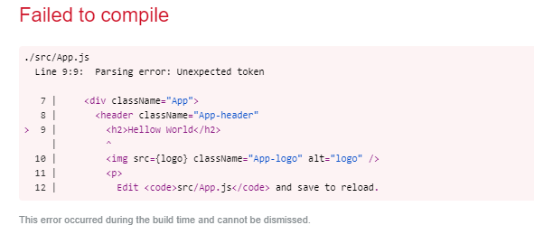
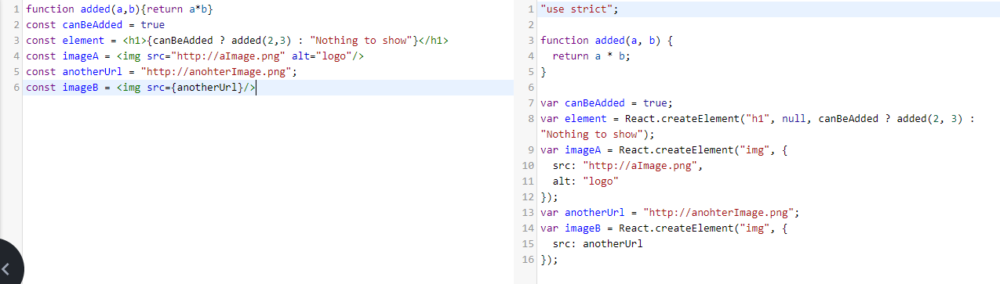
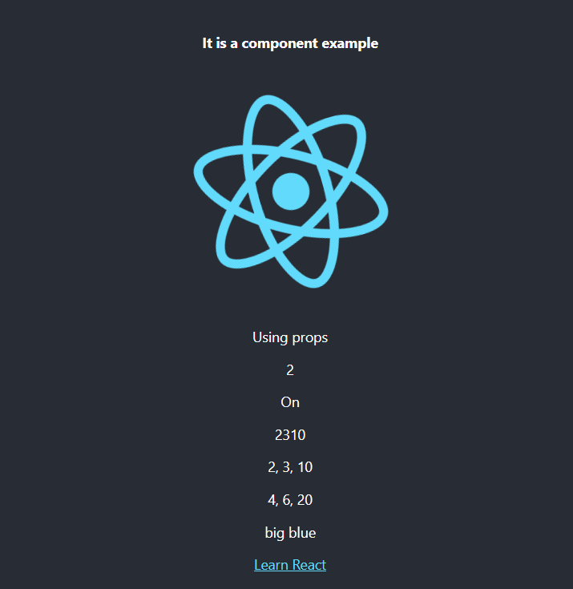

# React-Learning_ReactJS
Introduction to React.

It is based in a [Udemy](https://www.udemy.com/) course.

**Status: In develop**

<div align="center">

<br>
 [Aprendiendo ReactJS](https://www.udemy.com/course/aprendiendo-react/) by Miguel Ángel Durán García.

 </div>


### Personal Set Up
- CUP: i5-7600K@3.80GHz 
- RAM: 16GB
- Environment: Windows 10
- Browser: Google Chrome (80)
- IDE: Visual Studio Code (1.43)
- IDE Extensions: Markdown all in one 2.7.0, ESLint 2.1.1


## Table of contents
- [React-Learning_ReactJS](#react-learningreactjs)
    - [Personal Set Up](#personal-set-up)
  - [Table of contents](#table-of-contents)
- [1. Introduction](#1-introduction)
- [2. Enviroment set up](#2-enviroment-set-up)
  - [2.1. What we need?](#21-what-we-need)
  - [2.2. Install Node.js and NPM](#22-install-nodejs-and-npm)
  - [2.3. Install Create React App package](#23-install-create-react-app-package)
  - [2.4. Viewing App.js: Hellow World](#24-viewing-appjs-hellow-world)
  - [2.5. Linter for Visual Studio Code](#25-linter-for-visual-studio-code)
- [3. Basic Concepts](#3-basic-concepts)
  - [3.1. What is JSX](#31-what-is-jsx)
  - [3.2. Components](#32-components)
  - [3.3. Props](#33-props)
    - [Pattern to add props](#pattern-to-add-props)
- [4. Conditional Render and list](#4-conditional-render-and-list)
- [5. React Developer Tools](#5-react-developer-tools)
- [6. Events and Forms](#6-events-and-forms)
- [7. Children and Prototypes](#7-children-and-prototypes)
- [8. Components life cicle](#8-components-life-cicle)
- [9. Good Practices](#9-good-practices)
- [10. Project: Online film seeker](#10-project-online-film-seeker)
- [11. Redux: Application's Global Manager](#11-redux-applications-global-manager)


# 1. Introduction
- React was development by Facebook
- React is used by many relevant webs like LinkedIn, Airbnb, Twitter and fotocasa

# 2. Enviroment set up
## 2.1. What we need?
- It is necessary a IDE to develop the applications
- Node.js to use his dependencies manager (NPM) to install the needed libraries
- Create React App, is a Facebook tool let build a React app envorinment
- Inter, is a tool help to void errors and support the devlopment

## 2.2. Install Node.js and NPM
Node let us execute JavaScript code in the server side. Node can be dowloaded from the official web [Node](https://nodejs.org/es/), using the downloader and execute the file.

When the installation finish Node should be added to the user enviroment varaible PATH. To check it from a terminal console execute
```console
node -v
npm -v
```
If the command doesn't works, restart your machine to update the system changes.

For me are 12.16.1(Node) and 6.14.2(NPM).

## 2.3. Install Create React App package
- Access to https://github.com/facebook/create-react-app where the project are stored and check the readme file to verify you have the Node and NPM version required.
- Note that it is necesary **npx** tool. It makes easy to use CLI tools and other executables hosted on the registry.
- To use **npx** tool it is necessary npm **5.2 or higher** and **Node 8.16.0 or Node10.16.0 or later version**.
- To intall and create a applicaton execute the next command:
```console
npx create-react-app udemy-course
```
- Access into the application folder a check the structure project. Can see how the node_modules was added, pulbic folder where the application build is stored, src folder was creted with a index.js and a example component App.js (and other files), .gitignore file, dependencies files package-json and package-lock json, and a README.md that contains info about Create React App

<div align="center">



</div>


- By default Create React App build a application structure and define several scripts to execute. Execute the next commad to see the scripts which can be executed (the scripts are defined into package.json)
```console
npm run
```
- To run the application in the local machine (localhost:3000) in development mode execute the command start (remember you must stay into the application folder).
```console
npm start
```
```console
npm run start
```

## 2.4. Viewing App.js: Hellow World
This file was created automatically by Create React App tool. Can check how the first lines import components and libraries necessaries to define a React component.

```js
import React from 'react';
import logo from './logo.svg';
import './App.css';

function App() {
  return (
    <div className="App">
      <header className="App-header">
        
        <p>
          Edit <code>src/App.js</code> and save to reload.
        </p>
        <a
          className="App-link"
          href="https://reactjs.org"
          target="_blank"
          rel="noopener noreferrer"
        >
          Learn React
        </a>
      </header>
    </div>
  );
}

export default App;
```

Note **class** App (EC6) extends **Component** and has a **render()** method which returns a JSX (no HTML) code, it code type will be procesed and converted to JavaScript. At the bottom of the code can check how the component is **exported in default mode** to can be imported in another file.

If add new elements into render() method, can see how the page is updated automatically when save the file, it is called **Live Reloading**.
```js
  return (
    <div className="App">
      <header className="App-header">
        <h2>Hellow World</h2>        
        
        <p>
          Edit <code>src/App.js</code> and save to reload.
        </p>
        <a
          className="App-link"
          href="https://reactjs.org"
          target="_blank"
          rel="noopener noreferrer"
        >
          Learn React
        </a>
      </header>
    </div>
  );
```

## 2.5. Linter for Visual Studio Code
Is important check the terminal after execute a run, warnings and error could appears.

For example if remove a close tag the compiler show error in the terminal and browser. 
```console
Failed to compile.

./src/App.js
  Line 9:9:  Parsing error: Unexpected token

   7 |     <div className="App">
   8 |       <header className="App-header"
>  9 |         <h2>Hellow World</h2>
     |         ^
  10 |         
  11 |         <p>
  12 |           Edit <code>src/App.js</code> and save to reload.
```

<div align="center">



</div>

By the other way if remove the "alt" property in the img tag, the terimnal show a warning reporting the line.
```console
Compiled with warnings.

./src/App.js
  Line 10:9:  img elements must have an alt prop, either with meaningful text, or an empty string for decorative images  jsx-a11y/alt-text

Search for the keywords to learn more about each warning.
To ignore, add // eslint-disable-next-line to the line before.
```

Visual Studio Code has a lintern by default. Lintern is a tool that help us to check code errors the IDE. 

The Visual Studio Code lintern by deault need be configured correctly to use React. To fix the confituration:
- Create a **.eslintrc** file int he application root with the next code:
```json
{
  "extends": "react-app"
}
```
- Intall the ESLint extension.

# 3. Basic Concepts
React or ReactJS is a open source library developed in JavaScript for created user interfaces. Some React properties:
- Declarative
- Components based
- Ractive programing: Changes in the component generate new renders
- Virutal DOM
- Native events abstraction
  
The code always show "what" must render the user interface but not "how" it be renderized, the "how" is a React work.

## 3.1. What is JSX
Is a language created by Facebook (too) that using a transpiler like [Babel](https://babeljs.io/), is he transpiler used by Create React, is converted to JavaScript.

Use Babel web page to check how JSX code is transpiler. JSX help to write the code usin React. Write code using React library without JSX is so dificulty (check in Babe).

JSX let write HTML and JavaSciprt together. For examplo when create a element in JSX to transpiler can see how a React.createElement function is invoked with three params, the tag name, the attributes and the childrens.

<div align="center">



</div>


All elements must be composed by one tag. If the component created has several tag, you must wrap it into a div tag.
```jsx
const element = <h1>A title</h1><h2>Another Title</h2> //ERROR
const element = <div><h1>A title</h1><h2>Another Title</h2></div> //OK
```

## 3.2. Components
The React component let divide your user interface in serveral blocks. It help to make the code reusable and maintainable.

Using App.js created by default when the applications was created, is possible divide it in anohter components.

A component is a JavaScript function that accept params called properties or pros and return shomething. For this reason, it is possible extract h2 tag in a component, and the result will be the same. To use a component, use a tag with the same compnent name.

How can define a component?
1. Like classic function (the App compenent was created like function)
```jsx
import React from 'react';
import logo from './logo.svg';
import './App.css';

//New component Hello
function Hello(props){
  return <h2>Hello World! {props.title}</h2>;
}

function App() {
  return (
    <div className="App">
      <header className="App-header">
        <Hello title="React rules"/>
        <h4> It is a component example</h4>
        
        <p>
          Edit <code>src/App.js</code> and save to reload.
        </p>
        <a
          className="App-link"
          href="https://reactjs.org"
          target="_blank"
          rel="noopener noreferrer"
        >
          Learn React
        </a>
      </header>
    </div>
  );
}
```

2. Like a arrow function
```jsx
const Hello = (props) => <h2>Hello World! {props.title}</h2>;
```

3. Like a class (has advantages): It is necesary exteds Componet and at least one method called render. It is necesarry this reference to get the props.
```jsx
class Hello extends Component{
  render(){
    return (<h2>Hello World! {this.props.title}</h2>);
  }
}
```
## 3.3. Props
The props let parameterize the components. Modify App.js to add a new component inside Text with a prop type number. How can check the return of the new component is wrapped with a div, by other way generate a error. Props are defined into bracers and used into bracers too **{}**.
**The render() method must return one element**

```jsx
class Text extends Component {
  render() {
    const isText = this.props.boolean ? 'Yes' : 'No';
    return (
      <div>
        <p>Text: {this.props.text}</p>
        <p> Number: {this.props.number}</p>
        <p> Boolean: {this.props.boolean}</p>
        <p> Boolean: {JSON.stringify(this.props.boolean)} </p>
        <p> Boolean: {isText} </p>
        <p> Boolean2: {JSON.stringify(this.props.boolean2)} </p>
      </div>
    )
  }
}

...
<Text number={2} text="Using props" boolean={false} boolean2/>
```
The boolean props not are rendered, it is possible conert it to string.
It is possible render variables, no only props in the components.
If a **props** is indicated **without value**, the **default value is true**, check in the code boolean2 prop.

### Pattern to add props
- Each prop by line
- Alphabetically ordered 

It is so usable hand object into components due many APIs return objet. The next code show how define and use several props type (text, number, array, object)
```jsx
import React, { Component } from 'react';
import logo from './logo.svg';
import './App.css';

class Text extends Component {
  render() {
    const isText = this.props.isActivated ? 'On' : 'Off';
    const mappedNumbers = this.props.arrayOfNumbers.map(n => n * 2);
    return (
      <div>
        <p>{this.props.text}</p>
        <p>{this.props.number}</p>
        <p>{isText}</p>        
        <p>{this.props.arrayOfNumbers}</p>
        <p>{this.props.arrayOfNumbers.join(', ')}</p>
        <p>{mappedNumbers.join(', ')}</p>
        <p>{this.props.objectWithInfo.size} {this.props.objectWithInfo.color}</p>
      </div>
    )
  }
}

class App extends Component{
  render() { 
    return (
      <div className="App">
        <header className="App-header">          
          <h4> It is a component example</h4>
          
          <Text
            arrayOfNumbers={[2, 3, 10]}
            isActivated
            number={2}
            objectWithInfo={{color:'blue', size: 'big'}}
            text="Using props"
          />
          <a
            className="App-link"
            href="https://reactjs.org"
            target="_blank"
            rel="noopener noreferrer"
          >
            Learn React
          </a>
        </header>
      </div>
    );
  }
}

export default App;
```
<div align="center">



</div>


# 4. Conditional Render and list
# 5. React Developer Tools
# 6. Events and Forms
# 7. Children and Prototypes
# 8. Components life cicle
# 9. Good Practices
# 10. Project: Online film seeker
# 11. Redux: Application's Global Manager