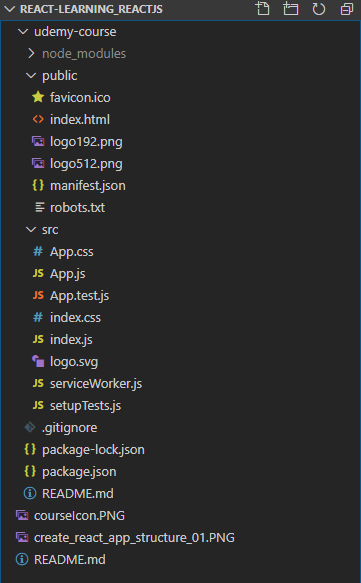
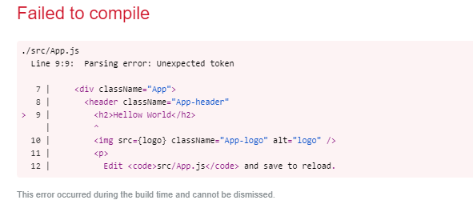
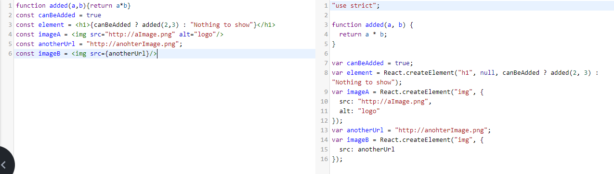
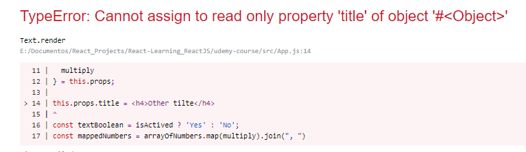
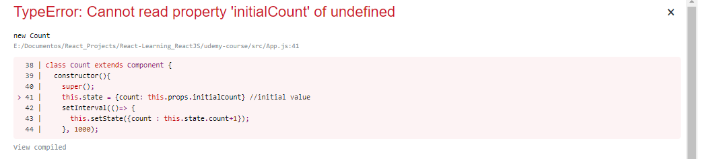
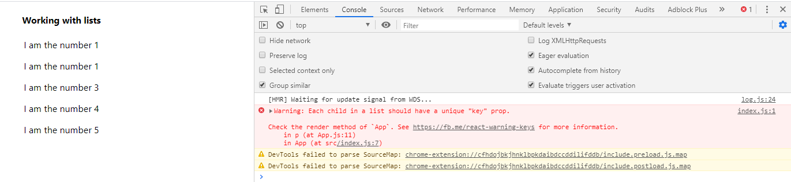
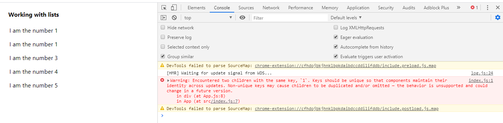

# React-Learning_ReactJS
Introduction to React.

It is based in a [Udemy](https://www.udemy.com/) course.

**Status: In develop**

<div align="center">

<br>
 [Aprendiendo ReactJS](https://www.udemy.com/course/aprendiendo-react/) by Miguel Ángel Durán García.

 </div>


### Personal Set Up
- CUP: i5-7600K@3.80GHz 
- RAM: 16GB
- Environment: Windows 10
- Browser: Google Chrome (80)
- IDE: Visual Studio Code (1.43)
- IDE Extensions: Markdown all in one 2.7.0, ESLint 2.1.1


## Table of contents
- [React-Learning_ReactJS](#react-learningreactjs)
    - [Personal Set Up](#personal-set-up)
  - [Table of contents](#table-of-contents)
- [1. Introduction](#1-introduction)
- [2. Enviroment set up](#2-enviroment-set-up)
  - [2.1. What we need?](#21-what-we-need)
  - [2.2. Install Node.js and NPM](#22-install-nodejs-and-npm)
  - [2.3. Install Create React App package](#23-install-create-react-app-package)
  - [2.4. Viewing App.js: Hellow World](#24-viewing-appjs-hellow-world)
  - [2.5. Linter for Visual Studio Code](#25-linter-for-visual-studio-code)
- [3. Basic Concepts](#3-basic-concepts)
  - [3.1. What is JSX](#31-what-is-jsx)
  - [3.2. Components](#32-components)
  - [3.3. Props](#33-props)
    - [Pattern to add Props](#pattern-to-add-props)
    - [Functions and Elements like Props](#functions-and-elements-like-props)
    - [Props's Immutability](#propss-immutability)
    - [Default Props](#default-props)
  - [3.4. State](#34-state)
    - [How initialize a state using Class Fields](#how-initialize-a-state-using-class-fields)
    - [Update state using setState](#update-state-using-setstate)
    - [The state propagation](#the-state-propagation)
    - [Initial state with props](#initial-state-with-props)
- [4. Conditional Render and list](#4-conditional-render-and-list)
  - [4.1. Conditional Rendering](#41-conditional-rendering)
  - [4.2. Working with list](#42-working-with-list)
  - [4.3. Working with objects list](#43-working-with-objects-list)
- [5. React Developer Tools](#5-react-developer-tools)
- [6. Events and Forms](#6-events-and-forms)
- [7. Children and Prototypes](#7-children-and-prototypes)
- [8. Components life cicle](#8-components-life-cicle)
- [9. Good Practices](#9-good-practices)
- [10. Project: Online film seeker](#10-project-online-film-seeker)
- [11. Redux: Application's Global Manager](#11-redux-applications-global-manager)


# 1. Introduction
- React was development by Facebook
- React is used by many relevant webs like LinkedIn, Airbnb, Twitter and fotocasa

# 2. Enviroment set up
## 2.1. What we need?
- It is necessary a IDE to develop the applications
- Node.js to use his dependencies manager (NPM) to install the needed libraries
- Create React App, is a Facebook tool let build a React app envorinment
- Inter, is a tool help to void errors and support the devlopment

## 2.2. Install Node.js and NPM
Node let us execute JavaScript code in the server side. Node can be dowloaded from the official web [Node](https://nodejs.org/es/), using the downloader and execute the file.

When the installation finish Node should be added to the user enviroment varaible PATH. To check it from a terminal console execute
```console
node -v
npm -v
```
If the command doesn't works, restart your machine to update the system changes.

For me are 12.16.1(Node) and 6.14.2(NPM).

## 2.3. Install Create React App package
- Access to https://github.com/facebook/create-react-app where the project are stored and check the readme file to verify you have the Node and NPM version required.
- Note that it is necesary **npx** tool. It makes easy to use CLI tools and other executables hosted on the registry.
- To use **npx** tool it is necessary npm **5.2 or higher** and **Node 8.16.0 or Node10.16.0 or later version**.
- To intall and create a applicaton execute the next command:
```console
npx create-react-app udemy-course
```
- Access into the application folder a check the structure project. Can see how the node_modules was added, pulbic folder where the application build is stored, src folder was creted with a index.js and a example component App.js (and other files), .gitignore file, dependencies files package-json and package-lock json, and a README.md that contains info about Create React App

<div align="center">



</div>


- By default Create React App build a application structure and define several scripts to execute. Execute the next commad to see the scripts which can be executed (the scripts are defined into package.json)
```console
npm run
```
- To run the application in the local machine (localhost:3000) in development mode execute the command start (remember you must stay into the application folder).
```console
npm start
```
```console
npm run start
```

## 2.4. Viewing App.js: Hellow World
This file was created automatically by Create React App tool. Can check how the first lines import components and libraries necessaries to define a React component.

```js
import React from 'react';
import logo from './logo.svg';
import './App.css';

function App() {
  return (
    <div className="App">
      <header className="App-header">
        
        <p>
          Edit <code>src/App.js</code> and save to reload.
        </p>
        <a
          className="App-link"
          href="https://reactjs.org"
          target="_blank"
          rel="noopener noreferrer"
        >
          Learn React
        </a>
      </header>
    </div>
  );
}

export default App;
```

Note **class** App (EC6) extends **Component** and has a **render()** method which returns a JSX (no HTML) code, it code type will be procesed and converted to JavaScript. At the bottom of the code can check how the component is **exported in default mode** to can be imported in another file.

If add new elements into render() method, can see how the page is updated automatically when save the file, it is called **Live Reloading**.
```js
  return (
    <div className="App">
      <header className="App-header">
        <h2>Hellow World</h2>        
        
        <p>
          Edit <code>src/App.js</code> and save to reload.
        </p>
        <a
          className="App-link"
          href="https://reactjs.org"
          target="_blank"
          rel="noopener noreferrer"
        >
          Learn React
        </a>
      </header>
    </div>
  );
```

## 2.5. Linter for Visual Studio Code
Is important check the terminal after execute a run, warnings and error could appears.

For example if remove a close tag the compiler show error in the terminal and browser. 
```console
Failed to compile.

./src/App.js
  Line 9:9:  Parsing error: Unexpected token

   7 |     <div className="App">
   8 |       <header className="App-header"
>  9 |         <h2>Hellow World</h2>
     |         ^
  10 |         
  11 |         <p>
  12 |           Edit <code>src/App.js</code> and save to reload.
```

<div align="center">



</div>

By the other way if remove the "alt" property in the img tag, the terimnal show a warning reporting the line.
```console
Compiled with warnings.

./src/App.js
  Line 10:9:  img elements must have an alt prop, either with meaningful text, or an empty string for decorative images  jsx-a11y/alt-text

Search for the keywords to learn more about each warning.
To ignore, add // eslint-disable-next-line to the line before.
```

Visual Studio Code has a lintern by default. Lintern is a tool that help us to check code errors the IDE. 

The Visual Studio Code lintern by deault need be configured correctly to use React. To fix the confituration:
- Create a **.eslintrc** file int he application root with the next code:
```json
{
  "extends": "react-app"
}
```
- Intall the ESLint extension.

# 3. Basic Concepts
React or ReactJS is a open source library developed in JavaScript for created user interfaces. Some React properties:
- Declarative: What must render but no how render it
- Ractive programing: Changes in the component generate new renders
- Components based
- Virutal DOM
- Native events abstraction
  
The code always show "what" must render the user interface but not "how" it be renderized, the "how" is a React work.

## 3.1. What is JSX
Is a language created by Facebook (too) that using a transpiler like [Babel](https://babeljs.io/), is the transpiler used by Create React App, is converted to JavaScript.

Use Babel web page to check how JSX code is transpiler. JSX help to write the code usin React. Write code using React library without JSX is so dificulty (check in Babe).

JSX let write HTML and JavaSciprt together. For examplo when create a element in JSX to transpiler can see how a React.createElement function is invoked with three params, the tag name, the attributes and the childrens.

<div align="center">



</div>


All elements must be composed by one tag. If the component created has several tag, you must wrap it into a div tag.
```jsx
const element = <h1>A title</h1><h2>Another Title</h2> //ERROR
const element = <div><h1>A title</h1><h2>Another Title</h2></div> //OK
```

## 3.2. Components
The React component let divide your user interface in serveral blocks. It help to make the code reusable and maintainable.

Using App.js created by default when the applications was created, is possible divide it in anohter components.

A component is a JavaScript function that accept params called properties or pros and return shomething. For this reason, it is possible extract h2 tag in a component, and the result will be the same. To use a component, use a tag with the same compnent name.

How can define a component?
1. Like classic function (the App compenent was created like function)
```jsx
import React from 'react';
import logo from './logo.svg';
import './App.css';

//New component Hello
function Hello(props){
  return <h2>Hello World! {props.title}</h2>;
}

function App() {
  return (
    <div className="App">
      <header className="App-header">
        <Hello title="React rules"/>
        <h4> It is a component example</h4>
        
        <p>
          Edit <code>src/App.js</code> and save to reload.
        </p>
        <a
          className="App-link"
          href="https://reactjs.org"
          target="_blank"
          rel="noopener noreferrer"
        >
          Learn React
        </a>
      </header>
    </div>
  );
}
```

2. Like a arrow function
```jsx
const Hello = (props) => <h2>Hello World! {props.title}</h2>;
```

3. Like a class (has advantages): It is necesary exteds Componet and at least one method called render. It is necesarry this reference to get the props.
```jsx
class Hello extends Component{
  render(){
    return (<h2>Hello World! {this.props.title}</h2>);
  }
}
```
## 3.3. Props
The props let parameterize the components. Modify App.js to add a new component inside Text with a prop type number. How can check the return of the new component is wrapped with a div, by other way generate a error. Props are defined into bracers and used into bracers too **{}**.
**The render() method must return one element**

```jsx
class Text extends Component {
  render() {
    const isText = this.props.boolean ? 'Yes' : 'No';
    return (
      <div>
        <p>Text: {this.props.text}</p>
        <p> Number: {this.props.number}</p>
        <p> Boolean: {this.props.boolean}</p>
        <p> Boolean: {JSON.stringify(this.props.boolean)} </p>
        <p> Boolean: {isText} </p>
        <p> Boolean2: {JSON.stringify(this.props.boolean2)} </p>
      </div>
    )
  }
}

...
<Text number={2} text="Using props" boolean={false} boolean2/>
```
The boolean props not are rendered, it is possible conert it to string.
It is possible render variables, no only props in the components.
If a **props** is indicated **without value**, the **default value is true**, check in the code boolean2 prop.

### Pattern to add Props
- Each prop by line
- Alphabetically ordered 

It is so usable hand object into components due many APIs return objet. The next code show how define and use several props type (text, number, array, object)
```jsx
import React, { Component } from 'react';
import logo from './logo.svg';
import './App.css';

class Text extends Component {
  render() {
    const isText = this.props.isActivated ? 'On' : 'Off';
    const mappedNumbers = this.props.arrayOfNumbers.map(n => n * 2);
    return (
      <div>
        <p>{this.props.text}</p>
        <p>{this.props.number}</p>
        <p>{isText}</p>        
        <p>{this.props.arrayOfNumbers}</p>
        <p>{this.props.arrayOfNumbers.join(', ')}</p>
        <p>{mappedNumbers.join(', ')}</p>
        <p>{this.props.objectWithInfo.size} {this.props.objectWithInfo.color}</p>
      </div>
    )
  }
}

class App extends Component{
  render() { 
    return (
      <div className="App">
        <header className="App-header">          
          <h4> It is a component example</h4>
          
          <Text
            arrayOfNumbers={[2, 3, 10]}
            isActivated
            number={2}
            objectWithInfo={{color:'blue', size: 'big'}}
            text="Using props"
          />
          <a
            className="App-link"
            href="https://reactjs.org"
            target="_blank"
            rel="noopener noreferrer"
          >
            Learn React
          </a>
        </header>
      </div>
    );
  }
}

export default App;
```
<div align="center">


</div>

### Functions and Elements like Props
One of the more important props that a component can have is a **function**.
When write this.props several time, the code turn complex, is typical use the restructuration:
```jsx
import React, { Component } from 'react';
import logo from './logo.svg';
import './App.css';

class Text extends Component {
  render() {    
    // Restructuration
    const {
      arrayOfNumbers,
      isActived,
      multiply // Function
    } = this.props;

    const textBoolean = isActived ? 'Yes' : 'No';
    const mappedNumbers = arrayOfNumbers.map(multiply).join(", ")
    return (
      <div>
        <p>{textBoolean}</p>
        <p>Result: {multiply(5)}</p>
        <p>Result map: {mappedNumbers}</p>
      </div>
    )
  }
}

class App extends Component{
  render() { 
    return (
      <div className="App">
        <header className="App-header">          
          <h4> It is a component example</h4>
          
          <Text
            arrayOfNumbers = {[2,4,5]}
            isActived
            multiply={(number) => number*2} //Function
          />
          <a
            className="App-link"
            href="https://reactjs.org"
            target="_blank"
            rel="noopener noreferrer"
          >
            Learn React
          </a>
        </header>
      </div>
    );
  }
}

export default App;
```

The last props type are **elements**. Theses elements are **React Elements**

```js
import React, { Component } from 'react';
import logo from './logo.svg';
import './App.css';

class Text extends Component {
  render() {
    //restructuration
    const {
      arrayOfNumbers,
      isActived,
      multiply, // Function
      title // React Element
    } = this.props;

    const textBoolean = isActived ? 'Yes' : 'No';
    const mappedNumbers = arrayOfNumbers.map(multiply).join(", ")
    return (
      <div>
        {title}
        <p>{textBoolean}</p>
        <p>Result: {multiply(5)}</p>
        <p>Result map: {mappedNumbers}</p>
      </div>
    )
  }
}

class App extends Component{
  render() { 
    return (
      <div className="App">
        <header className="App-header">          
          <h4> It is a component example</h4>
          
          <Text
            arrayOfNumbers = {[2,4,5]}
            isActived
            multiply={(number) => number*2} // Function
            title={<h1>It is a title</h1>} // React Element
          />
          <a
            className="App-link"
            href="https://reactjs.org"
            target="_blank"
            rel="noopener noreferrer"
          >
            Learn React
          </a>
        </header>
      </div>
    );
  }
}

export default App;
```
### Props's Immutability
React determine that props are inmutables, are read only (like pure functions).
If try change the title prop value for example, will get a TypeError message in exectution time (no compile time). For this reason is good practice the props restructuration (force set the prop to const and work with the constant).
```js
import React, { Component } from 'react';
import logo from './logo.svg';
import './App.css';

class Text extends Component {
  render() {
    //Restructuration
    const {
      arrayOfNumbers,
      isActived,
      multiply      
    } = this.props;

    this.props.title = <h4>Other tilte</h4> // try change title prop

    const textBoolean = isActived ? 'Yes' : 'No';
    const mappedNumbers = arrayOfNumbers.map(multiply).join(", ")
    return (
      <div>
        {this.props.title}
        <p>{textBoolean}</p>
        <p>Result: {multiply(5)}</p>
        <p>Result map: {mappedNumbers}</p>
      </div>
    )
  }
}

class App extends Component{
  render() { 
    return (
      <div className="App">
        <header className="App-header">          
          <h4> It is a component example</h4>
          
          <Text
            arrayOfNumbers = {[2,4,5]}
            isActived
            multiply={(number) => number*2}
            title={<h1>It is a title</h1>}
          />
          <a
            className="App-link"
            href="https://reactjs.org"
            target="_blank"
            rel="noopener noreferrer"
          >
            Learn React
          </a>
        </header>
      </div>
    );
  }
}
export default App;
```

<div align="center">



</div>

### Default Props
Some times is necessary have a default values for props, and avoid them are explicity seted, for example is use a component where is render use a prop, and this prop not is setted when te component is invoked:
```js
class Title extends Component {
  render(){
    return <h1>{this.props.text}</h1>
  }  
}

...

<Title/> //Note the prop "text" not is defined, any thing is shown
```

To assign a default props value use the keyword **defaultProps** like:
```js
class Title extends Component {
  render() {
  return <h1>{this.props.text} - {this.props.text2}</h1>
  }
}
Title.defaultProps = {
  text: 'Default Component Title',
  text2: 'Another Default Title'
}  
...

<Title text="Hi"/> //Now "Hi" is shown for text and default title is shown for text2 because it not is defined
```
If the prop is setted when the component is used, this value replace to the default prop value.

Default props is the way to sure the component works if need mandatory props.

## 3.4. State
The props change the component rendering but want that component be reactive. For this work is necesary use the **state**. To add the state is necesary use the **constructor** method.
```js
class Count extends Component {
  constructor(){
    super();
    this.state = {count:1} //initial value
  }

  render(){
  return <span>{this.state.count}</span>
  }
}
```
### How initialize a state using Class Fields
Eventually will be possible declare the stete out of the constructor, like a class field.
```js
class Count extends Component {
  state = {count:1} //initial value

  render(){
  return <span>{this.state.count}</span>
  }
}
```
If the browser doesn't support this state declaration way, should use Babel to tranpile the code. If use create-react-app, this transformation is supported by default.

### Update state using setState
React is declarative y reactive, the state is the key for theses features.
No must change the state the component directly, React opimize the moments when should update the component, for this reason, the state no must change with this.state="something", must use **setState()**.

If try change directly the state, the Linter should warning us.

```js
class Count extends Component {
  constructor(){
    super();
    this.state = {count:1} //initial value
    setInterval(()=>this.state.count=this.state.count+1, 1000);// new state
  }

  render(){
  return <span>{this.state.count}</span>
  }
}
```
```console
Do not mutate state directly. Use setState()  react/no-direct-mutation-state
```

Importante:
- The **state is inmutable**
- To change **the state only using setState() method**
- setState depends of React actions queue, is **asyncronous**

### The state propagation
In React the componentent state is inherited from is parent. When the parent state change produce the rendering of all his children.
```js
class Count extends Component {
  constructor(){
    super();
    this.state = {count:1} //initial value
    setInterval(()=> {
      this.setState({count : this.state.count+1});
    }, 1000);
  }

  render(){
  return <NumberCount number={this.state.count}/>
  }
}

class NumberCount extends Component {
  render(){
    return <span>{this.props.number}</span>
  }
}
```
In the above example:
- In Count The setInterval method change the state each second
- The state change produces the Count rendering
- The number prop is updated with the new this.state.count value.
- How the number prop change due the state change, produce a NumberCount render.

### Initial state with props
For this is necessary asing the initial state with a prop value. For do this must pass the props like params in the super method and contructor
```js
class Count extends Component {
  constructor(props){
    super(props);
    this.state = {count: this.props.initialCount} //initial value
    setInterval(()=> {
      this.setState({count : this.state.count+1});
    }, 1000);
  }

  render(){
  return <NumberCount number={this.state.count}/>
  }
}
```
<div align="center">



</div>

Like was explained in props sections, when is necesary prop to initialize the Componente, this prop must be initialize with **defaultprops**.
```js
import React, { Component } from 'react';
import logo from './logo.svg';
import './App.css';

class Count extends Component {
  constructor(props){
    super(props);
    console.log(this.props.initialCount)
    this.state = {count: this.props.initialCount} //initial value
    setInterval(()=> {
      this.setState({count : this.state.count+1});
    }, 1000);
  }
  render(){
  return <NumberCount number={this.state.count}/>
  }
}
Count.defaultProps = {
  initialCount: 0
}

class NumberCount extends Component {
  render(){
    return <span>{this.props.number}</span>
  }
}

class App extends Component{
  render() { 
    return (
      <div className="App">
        <header className="App-header">          
          
          <Count initialCount={100}/>
          <a
            className="App-link"
            href="https://reactjs.org"
            target="_blank"
            rel="noopener noreferrer"
          >
            Learn React
          </a>
        </header>
      </div>
    );
  }
}
export default App;
```

According the code above:
- It is necessary pass the props in the constructor a super methods, if want initialize the state with a prop
- It is necessary declare a default prop for each prop used to initialize the state
- If use Count tag without declare initialCount, the value begin with the default value (0 in this case)
- If use Count tag declaring initialCount, the value begint with the value pass in the tag.

# 4. Conditional Render and list
Change the render according props and state is the base to create reactive application (conditional render).

In React is common work with list, check it, and render some components of the list. **Each element in the list must have a unique key**.

## 4.1. Conditional Rendering
In React is possilbe create components where according his props and current state, render different elements, it is called **conditional render**.

A example creating a conditional component:
```js
//ConditionalSection.js
import React, { Component } from 'react'

class ComponentA extends Component {
    render() {
        return(
            <p>It is the Compoenet A</p>
        )
    }
}

class ComponentB extends Component {
    render() {
        return(
            <p>It is the Compoenet B</p>
        )
    }
}

function useConditionalRendering(showA) {
    if (showA) return <ComponentA/>
    else return <ComponentB/>
}

export default class ConditionalSection extends Component{
    constructor() {
        super();
        this.state = { showA : true};
    }
    render() {
        return(
            <div>
                <h4>Conditional Rendering</h4>
                {useConditionalRendering(this.state.showA)}
            </div>
        )
    }
}
```
```js
//App.js
import React, { Component } from 'react';
import ConditionalSection from './sections/ConditionalSection'
import './App.css';

class App extends Component{
  render() { 
    return (
      <div className="App">
          <ConditionalSection/>
      </div>
    );
  }
}
export default App;
```
A usefull example for conditional rendering is the login and logout section in a web page
```js
import React, { Component } from 'react'

class LogingButton extends Component {
    render() {
        return(
            <button>Login</button>
        )
    }
}

class LogoutButton extends Component {
    render() {
        return(
            <div>
                <p>Welcome</p>
                <button>Logout</button>
            </div>
        )
    }
}

export default class ConditionalSection extends Component{
    constructor() {
        super();
        this.state = { logged : false};
    }
    render() {        
        return(
            <div>
                <h4>Conditional Rendering</h4>
                {this.state.logged ? <LogoutButton/> : <LogingButton/>}
            </div>
        )
    }
}
```
## 4.2. Working with list
Is usefull work with list when get information from APIs for example and we want show the data in a component.

Using map function over list is possible convert the list in React element.
```js
import React, { Component } from 'react';
import './App.css';

class App extends Component{
  render() { 
    const numbers = [1,1,3,4,5];
    return (
      <div className="App">
          <h4> Working with lists</h4>
          {numbers.map(number => {
              return <p>I am the number {number}</p>
          })}
      </div>
    );
  }
}
export default App;
```
Everything seems fine, but the browser console report a warning. **Each child in a list should have a uni "key" prop.**

<div align="center">



</div>

This warning is shown because to help React to indentify the elements and know which are been added, modified or removed, it is necessary user  unique key for each element in the list.

To add the key the browser show anohter wwarning, the key must be unique, in this example there are two numbers "1".

```js
return <p key={number}>I am the number {number}</p>
```

<div align="center">



</div>

In this case, the unique value that not is repeated is the array index. Usint it, the warning dissapears.

```js
  render() { 
    const numbers = [1,1,3,4,5];
    return (
      <div className="App">
          <h4> Working with lists</h4>
          {numbers.map((number,index) => {
              return <p key={index}>I am the number {number}</p>
          })}
      </div>
    );
  }
```

## 4.3. Working with objects list
Normally in the application the list used are objects lists. Create or get a JSON file to be red and convert it in React elements.

```js
import React, { Component } from 'react';
import './App.css';
import cars from './data/cars.json'

class App extends Component {
  render() {     
    return (
      <div className="App">
          <h4> Working with lists</h4>
          <ul>
            {
              cars.map(car => {
                return (<li key={car.id}>
                  <strong>Name:</strong> {car.name}
                  <strong> Company: </strong> {car.company}
                </li>)
              })
            }
          </ul>
      </div>
    );
  }
}
export default App;
```
If inspect the DOM, the prop key not is rendered. Using component structure, extract the car intem in a component.

```js
import React, { Component } from 'react';
import './App.css';
import cars from './data/cars.json'

class CarItem extends Component {
  render(){
    const {car} = this.props
    return (
        <li>
                 <strong>Name:</strong> {car.name}
                 <strong> Company: </strong> {car.company}
        </li>
    )
  }
}

class App extends Component {
  render() {     
    return (
      <div className="App">
          <h4> Working with lists</h4>
          <ul>
            {
              cars.map(car => {
               return <CarItem key={car.id} car={car}/>
              })
            }
          </ul>
      </div>
    );
  }
}
export default App;
```

Note the key must be setted in the iterator element (the map in this case). The key not is accesible from CarItem component. Key is not a prop if try access to the key inside CarItem component.

If want pass the key, you must use a prop with another name like id. **The prop key must be unique and is used internally by React**.


# 5. React Developer Tools
# 6. Events and Forms
# 7. Children and Prototypes
# 8. Components life cicle
# 9. Good Practices
# 10. Project: Online film seeker
# 11. Redux: Application's Global Manager