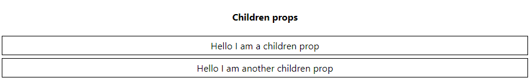
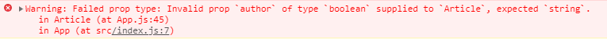
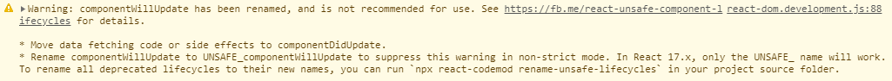
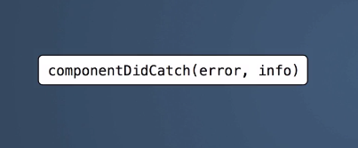

# React-Learning_ReactJS
Introduction to React.

It is based in a [Udemy](https://www.udemy.com/) course.

**Status: In develop**

<div align="center">

<br>
 [Aprendiendo ReactJS](https://www.udemy.com/course/aprendiendo-react/) by Miguel Ángel Durán García.

 </div>


### Personal Set Up
- CUP: i5-7600K@3.80GHz 
- RAM: 16GB
- Environment: Windows 10
- Browser: Google Chrome (80)
- IDE: Visual Studio Code (1.43)
- IDE Extensions: Markdown all in one 2.7.0, ESLint 2.1.1


## Table of contents
- [React-Learning_ReactJS](#react-learningreactjs)
    - [Personal Set Up](#personal-set-up)
  - [Table of contents](#table-of-contents)
- [1. Introduction](#1-introduction)
- [2. Enviroment set up](#2-enviroment-set-up)
  - [2.1. What we need?](#21-what-we-need)
  - [2.2. Install Node.js and NPM](#22-install-nodejs-and-npm)
  - [2.3. Install Create React App package](#23-install-create-react-app-package)
  - [2.4. Viewing App.js: Hellow World](#24-viewing-appjs-hellow-world)
  - [2.5. Linter for Visual Studio Code](#25-linter-for-visual-studio-code)
- [3. Basic Concepts](#3-basic-concepts)
  - [3.1. What is JSX](#31-what-is-jsx)
  - [3.2. Components](#32-components)
  - [3.3. Props](#33-props)
    - [Pattern to add Props](#pattern-to-add-props)
    - [Functions and Elements like Props](#functions-and-elements-like-props)
    - [Props's Immutability](#propss-immutability)
    - [Default Props](#default-props)
  - [3.4. State](#34-state)
    - [How initialize a state using Class Fields](#how-initialize-a-state-using-class-fields)
    - [Update state using setState](#update-state-using-setstate)
    - [The state propagation](#the-state-propagation)
    - [Initial state with props](#initial-state-with-props)
- [4. Conditional Render and list](#4-conditional-render-and-list)
  - [4.1. Conditional Rendering](#41-conditional-rendering)
  - [4.2. Working with list](#42-working-with-list)
  - [4.3. Working with objects list](#43-working-with-objects-list)
- [5. React Developer Tools](#5-react-developer-tools)
- [6. Events and Forms](#6-events-and-forms)
  - [6.1. Click Event](#61-click-event)
  - [6.2. Synthetic Events](#62-synthetic-events)
  - [6.3. Supported Events](#63-supported-events)
  - [6.4. Fomrs in React](#64-fomrs-in-react)
  - [6.5. Ref attribute in JSX](#65-ref-attribute-in-jsx)
  - [6.6. onSubmit and onChange Events](#66-onsubmit-and-onchange-events)
  - [6.7. Controled Components](#67-controled-components)
- [7. Children and Proptypes](#7-children-and-proptypes)
  - [7.1. Children prop](#71-children-prop)
  - [7.2. Proptype](#72-proptype)
- [8. Components life cycle](#8-components-life-cycle)
  - [8.1. Mount](#81-mount)
    - [constructor()](#constructor)
    - [componentWillMount()](#componentwillmount)
    - [render()](#render)
    - [componentDidMount()](#componentdidmount)
    - [Fetch API](#fetch-api)
  - [8.2. Updated](#82-updated)
    - [componentWillReceiveProps(nextProps)](#componentwillreceivepropsnextprops)
    - [shouldComponentUpdate(nextProps, nextState)](#shouldcomponentupdatenextprops-nextstate)
    - [Pure Component](#pure-component)
    - [componentWillUpdate(nextProps, nextState)](#componentwillupdatenextprops-nextstate)
    - [componentDidUpdate(prevProps, prevState)](#componentdidupdateprevprops-prevstate)
  - [8.3. UnMount](#83-unmount)
    - [comoponentWillUnmount()](#comoponentwillunmount)
  - [8.4. Error Cycle](#84-error-cycle)
    - [componentDidCatch(error,inf)](#componentdidcatcherrorinf)
- [9. Good Practices](#9-good-practices)
  - [9.1. Composition](#91-composition)
  - [9.2. Stateless Components](#92-stateless-components)
    - [Like function](#like-function)
    - [Like constant with arrow function](#like-constant-with-arrow-function)
  - [9.2. PropTypes in stateless Components](#92-proptypes-in-stateless-components)
  - [9.3. Container/Content Pattern](#93-containercontent-pattern)
    - [Container Componenent](#container-componenent)
    - [Content/Presentational Component](#contentpresentational-component)
  - [9.4.Component Strict-mode](#94component-strict-mode)
- [10. Project: Online films seeker](#10-project-online-films-seeker)
  - [10.1. Intallation](#101-intallation)
    - [Title.js (like presentational component and pure function)](#titlejs-like-presentational-component-and-pure-function)
    - [App.css](#appcss)
    - [SearchForm.js (like class component)](#searchformjs-like-class-component)
- [11. Redux: Application's Global Manager](#11-redux-applications-global-manager)


# 1. Introduction
- React was development by Facebook
- React is used by many relevant webs like LinkedIn, Airbnb, Twitter and fotocasa

# 2. Enviroment set up
## 2.1. What we need?
- It is necessary a IDE to develop the applications
- Node.js to use his dependencies manager (NPM) to install the needed libraries
- Create React App, is a Facebook tool let build a React app envorinment
- Inter, is a tool help to void errors and support the devlopment

## 2.2. Install Node.js and NPM
Node let us execute JavaScript code in the server side. Node can be dowloaded from the official web [Node](https://nodejs.org/es/), using the downloader and execute the file.

When the installation finish Node should be added to the user enviroment varaible PATH. To check it from a terminal console execute
```console
node -v
npm -v
```
If the command doesn't works, restart your machine to update the system changes.

For me are 12.16.1(Node) and 6.14.2(NPM).

## 2.3. Install Create React App package
- Access to https://github.com/facebook/create-react-app where the project are stored and check the readme file to verify you have the Node and NPM version required.
- Note that it is necesary **npx** tool. It makes easy to use CLI tools and other executables hosted on the registry.
- To use **npx** tool it is necessary npm **5.2 or higher** and **Node 8.16.0 or Node10.16.0 or later version**.
- To install create react app by global way:
```console
npm install -g create-react-app
```
- To intall and create a applicaton execute the next command:
```console
npx create-react-app udemy-course
```
- Access into the application folder a check the structure project. Can see how the node_modules was added, pulbic folder where the application build is stored, src folder was creted with a index.js and a example component App.js (and other files), .gitignore file, dependencies files package-json and package-lock json, and a README.md that contains info about Create React App

<div align="center">


</div>


- By default Create React App build a application structure and define several scripts to execute. Execute the next commad to see the scripts which can be executed (the scripts are defined into package.json)
```console
npm run
```
- To run the application in the local machine (localhost:3000) in development mode execute the command start (remember you must stay into the application folder).
```console
npm start
```
```console
npm run start
```

## 2.4. Viewing App.js: Hellow World
This file was created automatically by Create React App tool. Can check how the first lines import components and libraries necessaries to define a React component.

```js
import React from 'react';
import logo from './logo.svg';
import './App.css';

function App() {
  return (
    <div className="App">
      <header className="App-header">
        
        <p>
          Edit <code>src/App.js</code> and save to reload.
        </p>
        <a
          className="App-link"
          href="https://reactjs.org"
          target="_blank"
          rel="noopener noreferrer"
        >
          Learn React
        </a>
      </header>
    </div>
  );
}

export default App;
```

Note **class** App (EC6) extends **Component** and has a **render()** method which returns a JSX (no HTML) code, it code type will be procesed and converted to JavaScript. At the bottom of the code can check how the component is **exported in default mode** to can be imported in another file.

If add new elements into render() method, can see how the page is updated automatically when save the file, it is called **Live Reloading**.
```js
  return (
    <div className="App">
      <header className="App-header">
        <h2>Hellow World</h2>        
        
        <p>
          Edit <code>src/App.js</code> and save to reload.
        </p>
        <a
          className="App-link"
          href="https://reactjs.org"
          target="_blank"
          rel="noopener noreferrer"
        >
          Learn React
        </a>
      </header>
    </div>
  );
```

## 2.5. Linter for Visual Studio Code
Is important check the terminal after execute a run, warnings and error could appears.

For example if remove a close tag the compiler show error in the terminal and browser. 
```console
Failed to compile.

./src/App.js
  Line 9:9:  Parsing error: Unexpected token

   7 |     <div className="App">
   8 |       <header className="App-header"
>  9 |         <h2>Hellow World</h2>
     |         ^
  10 |         
  11 |         <p>
  12 |           Edit <code>src/App.js</code> and save to reload.
```

<div align="center">


</div>

By the other way if remove the "alt" property in the img tag, the terimnal show a warning reporting the line.
```console
Compiled with warnings.

./src/App.js
  Line 10:9:  img elements must have an alt prop, either with meaningful text, or an empty string for decorative images  jsx-a11y/alt-text

Search for the keywords to learn more about each warning.
To ignore, add // eslint-disable-next-line to the line before.
```

Visual Studio Code has a lintern by default. Lintern is a tool that help us to check code errors the IDE. 

The Visual Studio Code lintern by deault need be configured correctly to use React. To fix the confituration:
- Create a **.eslintrc** file int he application root with the next code:
```json
{
  "extends": "react-app"
}
```
- Intall the ESLint extension.

# 3. Basic Concepts
React or ReactJS is a open source library developed in JavaScript for created user interfaces. Some React properties:
- Declarative: What must render but no how render it
- Ractive programing: Changes in the component generate new renders
- Components based
- Virutal DOM
- Native events abstraction
  
The code always show "what" must render the user interface but not "how" it be renderized, the "how" is a React work.

## 3.1. What is JSX
Is a language created by Facebook (too) that using a transpiler like [Babel](https://babeljs.io/), is the transpiler used by Create React App, is converted to JavaScript.

Use Babel web page to check how JSX code is transpiler. JSX help to write the code usin React. Write code using React library without JSX is so dificulty (check in Babe).

JSX let write HTML and JavaSciprt together. For examplo when create a element in JSX to transpiler can see how a React.createElement function is invoked with three params, the tag name, the attributes and the childrens.

<div align="center">


</div>


All elements must be composed by one tag. If the component created has several tag, you must wrap it into a div tag.
```jsx
const element = <h1>A title</h1><h2>Another Title</h2> //ERROR
const element = <div><h1>A title</h1><h2>Another Title</h2></div> //OK
```

## 3.2. Components
The React component let divide your user interface in serveral blocks. It help to make the code reusable and maintainable.

Using App.js created by default when the applications was created, is possible divide it in anohter components.

A component is a JavaScript function that accept params called properties or pros and return shomething. For this reason, it is possible extract h2 tag in a component, and the result will be the same. To use a component, use a tag with the same compnent name.

How can define a component?
1. Like classic function (the App compenent was created like function)
```jsx
import React from 'react';
import logo from './logo.svg';
import './App.css';

//New component Hello
function Hello(props){
  return <h2>Hello World! {props.title}</h2>;
}

function App() {
  return (
    <div className="App">
      <header className="App-header">
        <Hello title="React rules"/>
        <h4> It is a component example</h4>
        
        <p>
          Edit <code>src/App.js</code> and save to reload.
        </p>
        <a
          className="App-link"
          href="https://reactjs.org"
          target="_blank"
          rel="noopener noreferrer"
        >
          Learn React
        </a>
      </header>
    </div>
  );
}
```

2. Like a arrow function
```jsx
const Hello = (props) => <h2>Hello World! {props.title}</h2>;
```

3. Like a class (has advantages): It is necesary exteds Componet and at least one method called render. It is necesarry this reference to get the props.
```jsx
class Hello extends Component{
  render(){
    return (<h2>Hello World! {this.props.title}</h2>);
  }
}
```
## 3.3. Props
The props let parameterize the components. Modify App.js to add a new component inside Text with a prop type number. How can check the return of the new component is wrapped with a div, by other way generate a error. Props are defined into bracers and used into bracers too **{}**.
**The render() method must return one element**

```jsx
class Text extends Component {
  render() {
    const isText = this.props.boolean ? 'Yes' : 'No';
    return (
      <div>
        <p>Text: {this.props.text}</p>
        <p> Number: {this.props.number}</p>
        <p> Boolean: {this.props.boolean}</p>
        <p> Boolean: {JSON.stringify(this.props.boolean)} </p>
        <p> Boolean: {isText} </p>
        <p> Boolean2: {JSON.stringify(this.props.boolean2)} </p>
      </div>
    )
  }
}

...
<Text number={2} text="Using props" boolean={false} boolean2/>
```
The boolean props not are rendered, it is possible conert it to string.
It is possible render variables, no only props in the components.
If a **props** is indicated **without value**, the **default value is true**, check in the code boolean2 prop.

### Pattern to add Props
- Each prop by line
- Alphabetically ordered 

It is so usable hand object into components due many APIs return objet. The next code show how define and use several props type (text, number, array, object)
```jsx
import React, { Component } from 'react';
import logo from './logo.svg';
import './App.css';

class Text extends Component {
  render() {
    const isText = this.props.isActivated ? 'On' : 'Off';
    const mappedNumbers = this.props.arrayOfNumbers.map(n => n * 2);
    return (
      <div>
        <p>{this.props.text}</p>
        <p>{this.props.number}</p>
        <p>{isText}</p>        
        <p>{this.props.arrayOfNumbers}</p>
        <p>{this.props.arrayOfNumbers.join(', ')}</p>
        <p>{mappedNumbers.join(', ')}</p>
        <p>{this.props.objectWithInfo.size} {this.props.objectWithInfo.color}</p>
      </div>
    )
  }
}

class App extends Component{
  render() { 
    return (
      <div className="App">
        <header className="App-header">          
          <h4> It is a component example</h4>
          
          <Text
            arrayOfNumbers={[2, 3, 10]}
            isActivated
            number={2}
            objectWithInfo={{color:'blue', size: 'big'}}
            text="Using props"
          />
          <a
            className="App-link"
            href="https://reactjs.org"
            target="_blank"
            rel="noopener noreferrer"
          >
            Learn React
          </a>
        </header>
      </div>
    );
  }
}

export default App;
```
<div align="center">


</div>

### Functions and Elements like Props
One of the more important props that a component can have is a **function**.
When write this.props several time, the code turn complex, is typical use the restructuration:
```jsx
import React, { Component } from 'react';
import logo from './logo.svg';
import './App.css';

class Text extends Component {
  render() {    
    // Restructuration
    const {
      arrayOfNumbers,
      isActived,
      multiply // Function
    } = this.props;

    const textBoolean = isActived ? 'Yes' : 'No';
    const mappedNumbers = arrayOfNumbers.map(multiply).join(", ")
    return (
      <div>
        <p>{textBoolean}</p>
        <p>Result: {multiply(5)}</p>
        <p>Result map: {mappedNumbers}</p>
      </div>
    )
  }
}

class App extends Component{
  render() { 
    return (
      <div className="App">
        <header className="App-header">          
          <h4> It is a component example</h4>
          
          <Text
            arrayOfNumbers = {[2,4,5]}
            isActived
            multiply={(number) => number*2} //Function
          />
          <a
            className="App-link"
            href="https://reactjs.org"
            target="_blank"
            rel="noopener noreferrer"
          >
            Learn React
          </a>
        </header>
      </div>
    );
  }
}

export default App;
```

The last props type are **elements**. Theses elements are **React Elements**

```js
import React, { Component } from 'react';
import logo from './logo.svg';
import './App.css';

class Text extends Component {
  render() {
    //restructuration
    const {
      arrayOfNumbers,
      isActived,
      multiply, // Function
      title // React Element
    } = this.props;

    const textBoolean = isActived ? 'Yes' : 'No';
    const mappedNumbers = arrayOfNumbers.map(multiply).join(", ")
    return (
      <div>
        {title}
        <p>{textBoolean}</p>
        <p>Result: {multiply(5)}</p>
        <p>Result map: {mappedNumbers}</p>
      </div>
    )
  }
}

class App extends Component{
  render() { 
    return (
      <div className="App">
        <header className="App-header">          
          <h4> It is a component example</h4>
          
          <Text
            arrayOfNumbers = {[2,4,5]}
            isActived
            multiply={(number) => number*2} // Function
            title={<h1>It is a title</h1>} // React Element
          />
          <a
            className="App-link"
            href="https://reactjs.org"
            target="_blank"
            rel="noopener noreferrer"
          >
            Learn React
          </a>
        </header>
      </div>
    );
  }
}

export default App;
```
### Props's Immutability
React determine that props are inmutables, are read only (like pure functions).
If try change the title prop value for example, will get a TypeError message in exectution time (no compile time). For this reason is good practice the props restructuration (force set the prop to const and work with the constant).
```js
import React, { Component } from 'react';
import logo from './logo.svg';
import './App.css';

class Text extends Component {
  render() {
    //Restructuration
    const {
      arrayOfNumbers,
      isActived,
      multiply      
    } = this.props;

    this.props.title = <h4>Other tilte</h4> // try change title prop

    const textBoolean = isActived ? 'Yes' : 'No';
    const mappedNumbers = arrayOfNumbers.map(multiply).join(", ")
    return (
      <div>
        {this.props.title}
        <p>{textBoolean}</p>
        <p>Result: {multiply(5)}</p>
        <p>Result map: {mappedNumbers}</p>
      </div>
    )
  }
}

class App extends Component{
  render() { 
    return (
      <div className="App">
        <header className="App-header">          
          <h4> It is a component example</h4>
          
          <Text
            arrayOfNumbers = {[2,4,5]}
            isActived
            multiply={(number) => number*2}
            title={<h1>It is a title</h1>}
          />
          <a
            className="App-link"
            href="https://reactjs.org"
            target="_blank"
            rel="noopener noreferrer"
          >
            Learn React
          </a>
        </header>
      </div>
    );
  }
}
export default App;
```

<div align="center">


</div>

### Default Props
Some times is necessary have a default values for props, and avoid them are explicity seted, for example is use a component where is render use a prop, and this prop not is setted when te component is invoked:
```js
class Title extends Component {
  render(){
    return <h1>{this.props.text}</h1>
  }  
}

...

<Title/> //Note the prop "text" not is defined, any thing is shown
```

To assign a default props value use the keyword **defaultProps** like:
```js
class Title extends Component {
  render() {
  return <h1>{this.props.text} - {this.props.text2}</h1>
  }
}
Title.defaultProps = {
  text: 'Default Component Title',
  text2: 'Another Default Title'
}  
...

<Title text="Hi"/> //Now "Hi" is shown for text and default title is shown for text2 because it not is defined
```
If the prop is setted when the component is used, this value replace to the default prop value.

Default props is the way to sure the component works if need mandatory props.

## 3.4. State
The props change the component rendering but want that component be reactive. For this work is necesary use the **state**. To add the state is necesary use the **constructor** method.
```js
class Count extends Component {
  constructor(){
    super();
    this.state = {count:1} //initial value
  }

  render(){
  return <span>{this.state.count}</span>
  }
}
```
### How initialize a state using Class Fields
Eventually will be possible declare the stete out of the constructor, like a class field.
```js
class Count extends Component {
  state = {count:1} //initial value

  render(){
  return <span>{this.state.count}</span>
  }
}
```
If the browser doesn't support this state declaration way, should use Babel to tranpile the code. If use create-react-app, this transformation is supported by default.

### Update state using setState
React is declarative y reactive, the state is the key for theses features.
No must change the state the component directly, React opimize the moments when should update the component, for this reason, the state no must change with this.state="something", must use **setState()**.

If try change directly the state, the Linter should warning us.

```js
class Count extends Component {
  constructor(){
    super();
    this.state = {count:1} //initial value
    setInterval(()=>this.state.count=this.state.count+1, 1000);// new state
  }

  render(){
  return <span>{this.state.count}</span>
  }
}
```
```console
Do not mutate state directly. Use setState()  react/no-direct-mutation-state
```

Importante:
- The **state is inmutable**
- To change **the state only using setState() method**
- setState depends of React actions queue, is **asyncronous**

### The state propagation
In React the componentent state is inherited from is parent. When the parent state change produce the rendering of all his children.
```js
class Count extends Component {
  constructor(){
    super();
    this.state = {count:1} //initial value
    setInterval(()=> {
      this.setState({count : this.state.count+1});
    }, 1000);
  }

  render(){
  return <NumberCount number={this.state.count}/>
  }
}

class NumberCount extends Component {
  render(){
    return <span>{this.props.number}</span>
  }
}
```
In the above example:
- In Count The setInterval method change the state each second
- The state change produces the Count rendering
- The number prop is updated with the new this.state.count value.
- How the number prop change due the state change, produce a NumberCount render.

### Initial state with props
For this is necessary asing the initial state with a prop value. For do this must pass the props like params in the super method and contructor
```js
class Count extends Component {
  constructor(props){
    super(props);
    this.state = {count: this.props.initialCount} //initial value
    setInterval(()=> {
      this.setState({count : this.state.count+1});
    }, 1000);
  }

  render(){
  return <NumberCount number={this.state.count}/>
  }
}
```
<div align="center">


</div>

Like was explained in props sections, when is necesary prop to initialize the Componente, this prop must be initialize with **defaultprops**.
```js
import React, { Component } from 'react';
import logo from './logo.svg';
import './App.css';

class Count extends Component {
  constructor(props){
    super(props);
    console.log(this.props.initialCount)
    this.state = {count: this.props.initialCount} //initial value
    setInterval(()=> {
      this.setState({count : this.state.count+1});
    }, 1000);
  }
  render(){
  return <NumberCount number={this.state.count}/>
  }
}
Count.defaultProps = {
  initialCount: 0
}

class NumberCount extends Component {
  render(){
    return <span>{this.props.number}</span>
  }
}

class App extends Component{
  render() { 
    return (
      <div className="App">
        <header className="App-header">          
          
          <Count initialCount={100}/>
          <a
            className="App-link"
            href="https://reactjs.org"
            target="_blank"
            rel="noopener noreferrer"
          >
            Learn React
          </a>
        </header>
      </div>
    );
  }
}
export default App;
```

According the code above:
- It is necessary pass the props in the constructor a super methods, if want initialize the state with a prop
- It is necessary declare a default prop for each prop used to initialize the state
- If use Count tag without declare initialCount, the value begin with the default value (0 in this case)
- If use Count tag declaring initialCount, the value begint with the value pass in the tag.

# 4. Conditional Render and list
Change the render according props and state is the base to create reactive application (conditional render).

In React is common work with list, check it, and render some components of the list. **Each element in the list must have a unique key**.

## 4.1. Conditional Rendering
In React is possilbe create components where according his props and current state, render different elements, it is called **conditional render**.

A example creating a conditional component:
```js
//ConditionalSection.js
import React, { Component } from 'react'

class ComponentA extends Component {
    render() {
        return(
            <p>It is the Compoenet A</p>
        )
    }
}

class ComponentB extends Component {
    render() {
        return(
            <p>It is the Compoenet B</p>
        )
    }
}

function useConditionalRendering(showA) {
    if (showA) return <ComponentA/>
    else return <ComponentB/>
}

export default class ConditionalSection extends Component{
    constructor() {
        super();
        this.state = { showA : true};
    }
    render() {
        return(
            <div>
                <h4>Conditional Rendering</h4>
                {useConditionalRendering(this.state.showA)}
            </div>
        )
    }
}
```
```js
//App.js
import React, { Component } from 'react';
import ConditionalSection from './sections/ConditionalSection'
import './App.css';

class App extends Component{
  render() { 
    return (
      <div className="App">
          <ConditionalSection/>
      </div>
    );
  }
}
export default App;
```
A usefull example for conditional rendering is the login and logout section in a web page
```js
import React, { Component } from 'react'

class LogingButton extends Component {
    render() {
        return(
            <button>Login</button>
        )
    }
}

class LogoutButton extends Component {
    render() {
        return(
            <div>
                <p>Welcome</p>
                <button>Logout</button>
            </div>
        )
    }
}

export default class ConditionalSection extends Component{
    constructor() {
        super();
        this.state = { logged : false};
    }
    render() {        
        return(
            <div>
                <h4>Conditional Rendering</h4>
                {this.state.logged ? <LogoutButton/> : <LogingButton/>}
            </div>
        )
    }
}
```
## 4.2. Working with list
Is usefull work with list when get information from APIs for example and we want show the data in a component.

Using map function over list is possible convert the list in React element.
```js
import React, { Component } from 'react';
import './App.css';

class App extends Component{
  render() { 
    const numbers = [1,1,3,4,5];
    return (
      <div className="App">
          <h4> Working with lists</h4>
          {numbers.map(number => {
              return <p>I am the number {number}</p>
          })}
      </div>
    );
  }
}
export default App;
```
Everything seems fine, but the browser console report a warning. **Each child in a list should have a uni "key" prop.**

<div align="center">


</div>

This warning is shown because to help React to indentify the elements and know which are been added, modified or removed, it is necessary user  unique key for each element in the list.

To add the key the browser show anohter wwarning, the key must be unique, in this example there are two numbers "1".

```js
return <p key={number}>I am the number {number}</p>
```

<div align="center">


</div>

In this case, the unique value that not is repeated is the array index. Usint it, the warning dissapears.

```js
  render() { 
    const numbers = [1,1,3,4,5];
    return (
      <div className="App">
          <h4> Working with lists</h4>
          {numbers.map((number,index) => {
              return <p key={index}>I am the number {number}</p>
          })}
      </div>
    );
  }
```

## 4.3. Working with objects list
Normally in the application the list used are objects lists. Create or get a JSON file to be red and convert it in React elements.

```js
import React, { Component } from 'react';
import './App.css';
import cars from './data/cars.json'

class App extends Component {
  render() {     
    return (
      <div className="App">
          <h4> Working with lists</h4>
          <ul>
            {
              cars.map(car => {
                return (<li key={car.id}>
                  <strong>Name:</strong> {car.name}
                  <strong> Company: </strong> {car.company}
                </li>)
              })
            }
          </ul>
      </div>
    );
  }
}
export default App;
```
If inspect the DOM, the prop key not is rendered. Using component structure, extract the car intem in a component.

```js
import React, { Component } from 'react';
import './App.css';
import cars from './data/cars.json'

class CarItem extends Component {
  render(){
    const {car} = this.props
    return (
        <li>
                 <strong>Name:</strong> {car.name}
                 <strong> Company: </strong> {car.company}
        </li>
    )
  }
}

class App extends Component {
  render() {     
    return (
      <div className="App">
          <h4> Working with lists</h4>
          <ul>
            {
              cars.map(car => {
               return <CarItem key={car.id} car={car}/>
              })
            }
          </ul>
      </div>
    );
  }
}
export default App;
```

Note the key must be setted in the iterator element (the map in this case). The key not is accesible from CarItem component. Key is not a prop if try access to the key inside CarItem component.

If want pass the key, you must use a prop with another name like id. **The prop key must be unique and is used internally by React**.


# 5. React Developer Tools
It is a key know how debuggint the application to find error and improve the performance.

The React Developer Tools help in the development and maintenance process.


[Chrome extension - React Developer Tools](https://chrome.google.com/webstore/detail/react-developer-tools/fmkadmapgofadopljbjfkapdkoienihi?hl=es). The extension project can be find in [Facebook Project - react-devtools](https://github.com/facebook/react-devtools). Lets inspect the elements react tree in any web built with React technology. The props and state is shown too.

With the extension installed, if acces a web page created in React, the icon turn on available. A example page is [fotocasa](https://www.fotocasa.es/es/). If open the developer tools with F12, can check how appears new tabs, in my React Developer Tools version 2 new tabs are added:

-  Component: hows you the root React components that were rendered on the page, as well as the subcomponents that they ended up rendering.
-  Profiler: To development environment, allows you to record performance information.


# 6. Events and Forms
It is basic get the events on the components

## 6.1. Click Event
For a component execute something when click on it, is necessary set a prop called **onClick** assigning a function.

```js
import React, { Component } from 'react';
import './App.css';

class App extends Component {  
  render() {     
    return (
      <div className="App">
        <h4>Events</h4>
        <button onClick={() => alert('hi!')}>Click here!</button>
      </div>
    );
  }
}
export default App;
```

It seems HTML but not is, the prop use camelCase and if inspect the DOM in the page, can check that attribute onclick no appears, because no is a HTML attribute, is a React prop. React bount the prop with the event internally

## 6.2. Synthetic Events
The function to set a element behaviour can get a param **event** like eventlistener in JavaScript.

I react, the event e returned is a special event, not he native event, called synthetic event. **This synthetic event wrap the native envet to be compatible with all React browsers supported**.

```js
import React, { Component } from 'react';
import './App.css';

class App extends Component {
  handleClick(e) {
    console.log(e);
    console.log(e.nativeEvent);
    alert('hi!')
  }

  render() {     
    return (
      <div className="App">
        <h4>Events</h4>
        <button onClick={this.handleClick}>Click here!</button>
      </div>
    );
  }
}
export default App;
```

If for some reason, wants access to the native event, it is possible using **e.nativeEvent**.

<div align="center">


</div>

## 6.3. Supported Events
It is possible found all supported events in the [React SyntheticEvents](https://reactjs.org/docs/events.html). The events list in JavaScript is so lenght, React actually only has available the more commun and important events.

For example, checking the [Mouse Events](https://reactjs.org/docs/events.html#mouse-events), test the onMouseMove event. When works with event is esential the context control, the two ways are:
- In the constructor binding the method: **this.handleMouseMove = this.handleMouseMove.bind(this)**
```js
  constructor(){
    super()
    this.state = {mouseX: 0, mouseY: 0};
    this.handleMouseMove = this.handleMouseMove.bind(this); // <-- binding way 1
  }
  handleMouseMove(e) {
    const {clientX, clientY} = e;
    this.setState({mouseX: clientX, mouseY: clientY});
  }  
```
- Using arrow function in the class definition, this way is more cleanning that the first. Because the arrow function bind the context always where are declared. It is the recommended way.
```js
  constructor(){
    super()
    this.state = {mouseX: 0, mouseY: 0};    
  }
  handleMouseMove = (e) => { // <-- binding way 2
    const {clientX, clientY} = e;
    this.setState({mouseX: clientX, mouseY: clientY});
  }
```

The example:
```js
import React, { Component } from 'react';
import './App.css';

class App extends Component {
  constructor(){
    super()
    this.state = {mouseX: 0, mouseY: 0};
    //this.handleMouseMove = this.handleMouseMove.bind(this); // <-- binding way 1    
  }

  handleMouseMove = (e) => { // <-- binding way 2 (recommended)
    const {clientX, clientY} = e;
    this.setState({mouseX: clientX, mouseY: clientY});
  }

  handleClick(e) {
    console.log(e);
    console.log(e.nativeEvent);
    alert('hi!')
  }

  render() {     
    return (
      <div className="App">
        <h4>Events</h4>
        <button onClick={this.handleClick}>Click here!</button>
        <div onMouseMove={this.handleMouseMove} style={{border:'1px solid #000', marginTop:'10', padding:'10'}}>
          <p>[{this.state.mouseX},{this.state.mouseY}]</p>
        </div>
      </div>
    );
  }
}
export default App;
```

## 6.4. Fomrs in React
The forms let the user report data in the application.

In HTML the las form button, if not has another function specified, it will be the submit form button.

To work with the form data, can recover the data with a event function (handleClick). With **e.preventDefault()** (The preventDefault() method cancels the event if it is cancelable, meaning that the default action that belongs to the event will not occur) avoid the button submit the information.

If report the attribute **name** in un HTML element, this element value will be reported in GET action (url)

A first form aproximaiton with React is the next (creatin Form component in /sections)

```js
//Form.js
import React, { Component } from 'react'

export default class Form extends Component{
    handleClick(e){
        e.preventDefault();
        const name = document.getElementById('name').value;
        const twitter = document.getElementById('twitter').value;
        console.log({name, twitter});
    }
    render(){
        return(
            <form>
                <p>
                    <label>Name: </label>
                    <input type='text' id='name' name='userName' placeholder='Enter your Name'/>
                </p>
                <p>
                    <label>Twitter: </label>
                    <input type='text' id='twitter' name='twitterAccount' placeholder='Enter your Twitter acount'/>
                </p>
                <button onClick={this.handleClick}>Submit</button>                
            </form>
        )
    }
}
```
```js
//App.js
import React, { Component } from 'react';
import './App.css';
import Form from './sections/Form'

class App extends Component {
  render() {     
    return (
      <div className="App">
        <h4>Forms</h4>
          <Form/>
      </div>
    );
  }
}
export default App;
```
But with React, the work with forms is different. Is use the attribute for (used to realtion a element with another) the console browser show a warning, for this reason in React must be user **htmlFor**

```js
<p>
    <label htmlFor='name'>Name: </label>
    <input type='text' id='name' name='userName' placeholder='Enter your Name'/>
</p>
<p>
    <label htmlFor='twitter'>Twitter: </label>
    <input type='text' id='twitter' name='twitterAccount' placeholder='Enter your Twitter acount'/>
</p>
```

## 6.5. Ref attribute in JSX
React has a special attribute called **ref**, and it can be added to any element. Is used to recover the element reference in the DOM. It is possible save the elements reference in the class conext using the **ref** attribute.

Remember use arrow function to assign the context when in a function use the **this** key.

```js
import React, { Component } from 'react'

export default class Form extends Component{
    handleClick = (e) => {
        e.preventDefault();
        const name = this.inputName.value;
        const twitter = this.inputTwitter.value;
        console.log({name, twitter});
    }
    render(){
        return(
            <form>
                <p>
                    <label htmlFor='name'>Name: </label>
                    <input ref={inputElement => this.inputName = inputElement} type='text' id='name' name='userName' placeholder='Enter your Name'/>
                </p>
                <p>
                    <label htmlFor='twitter'>Twitter: </label>
                    <input ref={inputElement => this.inputTwitter = inputElement} type='text' id='twitter' name='twitterAccount' placeholder='Enter your Twitter acount'/>
                </p>
                <button onClick={this.handleClick}>Submit</button>                
            </form>
        )
    }
}
```
User **ref** is a way to access into the component to the DOM elements but should avoid use this solution because make the code no declarative. There are another better ways to make references.

## 6.6. onSubmit and onChange Events
With React is possible too, the form envents control. The event onSubmit will be called same that the onClick on the submit button, for this reason, can change the example code. Called when the form info is submitted.

If the submit button has a action, onClick, this action will be execute before that the onSubmit action.

Ohther event so used is the onChange event, called when the input value change. Add a new element and assign a prop onChange with a action associated.

Another events are onInput, onInvalid and onInvalid.

```js
import React, { Component } from 'react'

export default class Form extends Component{
    handleSubmit = (e) => {
        e.preventDefault();
        const name = this.inputName.value;
        const twitter = this.inputTwitter.value;
        console.log('handleSubmit');
        console.log({name, twitter});
    }
    handleClick = (e) => {
        console.log('handleClick');
    }
    handleChange = (e) => {
        console.log('handleChange');
        console.log(e.target.checked);
    }
    render(){
        return(
            <form onSubmit={this.handleSubmit}>
                <p>
                    <label htmlFor='name'>Name: </label>
                    <input ref={inputElement => this.inputName = inputElement} type='text' id='name' name='userName' placeholder='Enter your Name'/>
                </p>
                <p>
                    <label htmlFor='twitter'>Twitter: </label>
                    <input ref={inputElement => this.inputTwitter = inputElement} type='text' id='twitter' name='twitterAccount' placeholder='Enter your Twitter acount'/>
                </p>
                
                <button onClick={this.handleClick}>Submit</button>                

                <p><label>
                    <input onChange={this.handleChange} ref={inputElement => this.inputTerms = inputElement} type='checkbox' id='terms' name='termsAccepted'/>
                    Accepted terms
                </label></p>
            </form>
        )
    }
}
```

## 6.7. Controled Components
In this moment, we have no controled components, because we are using native way to works with forms.

React provide control over components to work efficiently with forms. The form elements has internal state, and is this state wich we can use with React.

It is possible assign a initial value (state) to the elements. Doing this, now not is possible change the input values, will be necessary controled it internally (Warning message appears)

```js
import React, { Component } from 'react'

export default class Form extends Component{
    constructor(){
        super();
        this.state = {
            inputName: '',
            inputTwitter: '@',
            inputTerms: true
        }
    }
    handleSubmit = (e) => {
        e.preventDefault();
        const name = this.inputName.value;
        const twitter = this.inputTwitter.value;
        console.log('handleSubmit');
        console.log({name, twitter});
    }
    handleClick = (e) => {
        console.log('handleClick');
    }
    handleChange = (e) => {
        console.log('handleChange');
        console.log(e.target.checked);
    }
    render(){
        return(
            <form onSubmit={this.handleSubmit}>
                <p>
                    <label htmlFor='name'>Name: </label>
                    <input 
                        value={this.state.inputName} 
                        ref={inputElement => this.inputName = inputElement} 
                        type='text' id='name' name='userName' placeholder='Enter your Name'/>
                </p>
                <p>
                    <label htmlFor='twitter'>Twitter: </label>
                    <input 
                        value={this.state.inputTwitter} 
                        ref={inputElement => this.inputTwitter = inputElement} 
                        type='text' id='twitter' name='twitterAccount' placeholder='Enter your Twitter acount'/>
                </p>                
                <button onClick={this.handleClick}>Submit</button>                
                <p><label>
                    <input 
                        checked={this.state.inputTerms} 
                        onChange={this.handleChange} 
                        ref={inputElement => this.inputTerms = inputElement} 
                        type='checkbox' id='terms' name='termsAccepted'/>
                    Accepted terms
                </label></p>
            </form>
        )
    }
}
```

<div align='center'>


</div>

For solve it, is necessary add onChange prop to the inputs, and in this action the state must be updated. How the check box for accept the terms as a function associated with the onChange prop, is in this action where update the state.

Now not is necessary access to the values directly in the handleSubmit method, because the values now are in the state stored.

```js
import React, { Component } from 'react'

export default class Form extends Component{
    constructor(){
        super();
        this.state = {
            inputName: 'User',
            inputTwitter: '@',
            inputTerms: true
        }
    }
    handleSubmit = (e) => {
        e.preventDefault();
        console.log('handleSubmit');
        console.log(this.state);
    }
    handleClick = (e) => {
        console.log('handleClick');
    }
    handleChange = (e) => {
        this.setState({inputTerms: e.target.checked})
        console.log('handleChange');
        console.log(e.target.checked);
    }
    render(){
        return(
            <form onSubmit={this.handleSubmit}>
                <p>
                    <label htmlFor='name'>Name: </label>
                    <input 
                        value={this.state.inputName} 
                        onChange={e => this.setState({inputName: e.target.value})}
                        ref={inputElement => this.inputName = inputElement} 
                        type='text' id='name' name='userName' placeholder='Enter your Name'/>
                </p>
                <p>
                    <label htmlFor='twitter'>Twitter: </label>
                    <input 
                        value={this.state.inputTwitter}
                        onChange={e => this.setState({inputTwitter: e.target.value})}
                        ref={inputElement => this.inputTwitter = inputElement} 
                        type='text' id='twitter' name='twitterAccount' placeholder='Enter your Twitter acount'/>
                </p>                
                <button onClick={this.handleClick}>Submit</button>                
                <p><label>
                    <input 
                        checked={this.state.inputTerms} 
                        onChange={this.handleChange} 
                        ref={inputElement => this.inputTerms = inputElement} 
                        type='checkbox' id='terms' name='termsAccepted'/>
                    Accepted terms
                </label></p>
            </form>
        )
    }
}
```
**It is the most recommended way to works with forms in React**:
- state: To stored the elements values
- onChange: For the elements controled
- setState: To update the elements values

# 7. Children and Proptypes
Children is a prop whose value is the component content, it is use to create reusable Layouts.

The proptype is a way to validate the data type passed to the components.

## 7.1. Children prop
The children prop is used to create Layout or templates in the application.

In the next example can see, how is rendered the same component with different content using his **this.props.children**.

```js
import React, { Component } from 'react';
import './App.css';

class Box extends Component{
  render(){
    return(
      <div style={{border: '1px solid black', margin: '5px', padding: '5px'}}>
        {this.props.children}
      </div>
    )
  }
}

class App extends Component {
  render() {     
    return (
      <div className="App">
        <h4>Children props</h4>
          <Box>Hello I am a children prop</Box>
          <Box>Hello I am another children prop</Box>
      </div>
    );
  }
}
export default App;
```
<div align='center'>



</div>

It is possible nest several component with his children because with children the components are reusable.

```js
import React, { Component } from 'react';
import './App.css';

class Box extends Component{
  render(){
    return(
      <div style={{border: '1px solid black', margin: '5px', padding: '5px'}}>
        {this.props.children}
      </div>
    )
  }
}

class Article extends Component{
  render(){
    return(        
        <section>
          <h2>{this.props.title}</h2>
          <p>Wrote by {this.props.author} </p>
          <Box> {this.props.date} </Box>
          <section>
            {this.props.children}
          </section>
        </section>
    )
  }
}

class App extends Component {
  render() {     
    return (
      <div className="App">        
          <Article 
            author='Me' 
            date={new Date().toLocaleDateString()} 
            title='Article Example'>
              <p> 
                  This is a children example using a component inside another component
                  and both with children
             </p>
             <p>
                This is <strong> another paragragh inside the the component</strong>
             </p>
          </Article>
          <Article 
            author='Other One' 
            date={new Date().toLocaleDateString()} 
            title='Article Example 2'>
              <p> 
                  This is a children example using a component inside another component
                  and both with children
             </p>
             <p>
                This is <strong> another paragragh inside the the component</strong>
             </p>
          </Article>          
      </div>
    );
  }
}
export default App;
```

## 7.2. Proptype
In the example, to the component Article, it is passing all props with his type.But what happen.

It is interesting use conditional rendering to to avoid bad result if some prop not is reported (for example if remeove author prop).

```js
import React, { Component } from 'react';
import './App.css';

class Box extends Component{
  render(){
    return(
      <div style={{border: '1px solid black', margin: '5px', padding: '5px'}}>
        {this.props.children}
      </div>
    )
  }
}

class Article extends Component{
  constructor(props){
    super(props);
    if (typeof this.props.author === 'undefined'){
      console.warn('author is required');
      // throw new Error('author is required');
    }
  }
  render(){
    const {author, children, date, title} = this.props;
    return(
        <section>
          <h2>{title}</h2>
          {author && <p>Wrote by {author} </p>}
          <Box> {date} </Box>
          <section>
            {children}
          </section>
        </section>
    )
  }
}

class App extends Component {
  render() {     
    return (
      <div className="App">        
          <Article 
            
            date={new Date().toLocaleDateString()} 
            title='Article Example'>
              <p> 
                  This is a children example using a component inside another component
                  and both with children
             </p>
             <p>
                This is <strong> another paragragh inside the the component</strong>
             </p>
          </Article> 
      </div>
    );
  }
}
export default App;
```

It is possible add a **throw new Error('error description')** to avoid the application work if a data is necessary in the avaluation.

To specified the data type we can add more patchs, but it not is the right way, for the work there are **proptypes**.

The proptypes are using to check the props data type. Are a external dependency, for this reason is necessary install it.

```console
npm install prop-types -SE
```

The SE param is used to specified the exact version in the package.json. Reviewing the package.json file can chek how the dependency has been added. The package.json is the file where is stored the application properties and dependencies.

```js
"prop-types": "15.7.2",
```
In this moment is possible add the new dependency.
```js
import PropTypes from 'prop-types';
```
To use this library must declare the map of key value where the key is the prop name and the value is the prop type for the component.
```js
class Article extends Component{
  constructor(props){
    super(props);
    if (typeof this.props.author === 'undefined'){
      console.warn('author is required');
      // throw new Error('author is required');
    }
  }
  render(){
    const {author, children, date, title} = this.props;
    return(
        <section>
          <h2>{title}</h2>
          {author && <p>Wrote by {author} </p>}
          <Box> {date} </Box>
          <section>
            {children}
          </section>
        </section>
    )
  }
}
Article.propTypes = {
  author : PropTypes.string
}
```

Other way is assing the type like a static module into the class (is the most used). **It is the recommended way.**
```js
class Article extends Component{
  static propTypes = {
    author : PropTypes.string
  }
  constructor(props){
    super(props);
    if (typeof this.props.author === 'undefined'){
      console.warn('author is required');
      // throw new Error('author is required');
    }
  }
  render(){
    const {author, children, date, title} = this.props;
    return(
        <section>
          <h2>{title}</h2>
          {author && <p>Wrote by {author} </p>}
          <Box> {date} </Box>
          <section>
            {children}
          </section>
        </section>
    )
  }
}

class App extends Component {
  render() {     
    return (
      <div className="App">        
          <Article 
            author={true}
            date={new Date().toLocaleDateString()} 
            title='Article Example'>
              <p> 
                  This is a children example using a component inside another component
                  and both with children
             </p>
             <p>
                This is <strong> another paragragh inside the the component</strong>
             </p>
          </Article> 
      </div>
    );
  }
}
```

Checking the browser console can see how a error is shown, because we are passing a boolean in this prop, and this prop is specified by PropType that is a string.

<div align='center'>



</div>

Too is possible specified with propTypes a prop is mandatory, for do this only must concat **isRequired** key word to the propType.

```js
  static propTypes = {
    author : PropTypes.string.isRequired //specified author is a String and is Required
  }
```

If remove the author prop, in this case, check the browser console can see how a error is shown, because this prop is required and not is reporte.

<div align='center'>


</div>

This notices type are only available in Dev environemnt, in Prod environment no.

The propType library provides:

- The prop type
- If a prop is required

# 8. Components life cycle
There are some theorical concept that most knnow to work with react:

Component life cycle are the different states which a Reac component get and how can execute code in each of them. The life cycle is dividen in 3 phases.

1. Mount
2. Updated
3. Unmount

## 8.1. Mount
- It is execute always and only one time
- Build the component with the initial state
- Get the props reported
- Here is the moment/place where biding the class methods (**this.myMethod = this.myMethod.bind(this)**). Althought is more cleaning use arrow function in the method that need access to the class context
- The method render() is execute by first time

<div align='center'>


</div>

### constructor()
It is the first method executed. It is execute one time, init the component state and bind the method context. **Here the setState must not be called**.

By the default there are a constructor() method, not is necessary declare it (like other languages like Java). By default:
```js
constructor(...args){
  super(...args);
}
```
A right constructor use is (note the binding no appears because is mor cleaaning binding the mehods with arrow functions):
```js
constructor(props){
  super(props); //call the Component constructor
  this.state = { //init the state
    name : 'initName',
    age: 18,    
  }
}
```

### componentWillMount()
It is execute only one time just before that render and just after that constructor. Here is possible use setState and no produces another render. The comopnent not is available in DOM yet.

The main function in this method is init the configuration and init the state. Ready all data needed for the first render.

Normally this method not is so used. It used to separete constructor actions if it is son big.

**In React 17 and upper, this method is deprecated, is use it, the next warning appears in the browser console. The logic into this method must be moved to the constructor**

<div align='center'>


</div>

### render()
This method is called several times, always a prop is setted or the state change. Is the **unique mandatory method** in the componet. Returns the element to show in the interface.

The props to use o state will be the first in the component. If this method returns null, no render anything.

In the render never must called the setState method, because this would produce a infinite looping (render->changestate->render->changestate->etc). Furthermore musn't access to anything in the browser.

The method render must be a "pure function". Can returns a null, string, number, elemtent or another component. To returns several elements, them must be wrapped in a div tag (if use a React version under 16).

**It is possible return a element list but each element need a key, because it let to React indetify them. In React version 16 and upper the restriciton to show only one element (wrapeed with div) was removed.**
```js
return (
  <h1 key='A'>A title</h1>,
  <HelloRender key='B'>,
  <HelloRender key='C'>,
  <h3 key='D'>Another title</h3>
)
```

### componentDidMount()
When this method is executed, exist a element representation in DOM. It is possible listen events, perform server calls and use the setState method.

It is possible subscribe browser events too, but not theses subscribtions must be removed in the method **componentWillUmMount()**.

If the state is modified here, the method redner will be called again

<div align='center'>


</div>

```js
import React, { Component} from 'react';
import './App.css';

class App extends Component {
  constructor(props){
    console.log('constructor')
    super(props);
    this.state = {msg:new Date().toLocaleTimeString(), mouseX: 0, mouseY: 0};
  }

  componentDidMount(){
    console.log('componentDidMount')    
    document.addEventListener('click',(e)=>{ //this subscribing must be removed
      const {clientX, clientY} = e;
      this.setState({msg: new Date().toLocaleTimeString(), mouseX: clientX, mouseY: clientY});
      console.log(this.state)
    });
  }

  render(){     
    console.log('render')
    return (
      <div className="App">                 
        {this.state.msg} - ({this.state.mouseX},{this.state.mouseY})
      </div>
    );
  }
}
export default App;
```

### Fetch API
The [Fetch API](https://developer.mozilla.org/es/docs/Web/API/Fetch_API) let recover resources even the net. This API is compatible with all browsers. **The API manage the responses like promise**.

Normally is use to request resources to a API. Must convert the response in JSON object, easy to hand in the React component.

Remenber that method **componentDiDMout()** is the best place to recover data, for this reason, the API call should be executed here.

```js
import React, {Component} from 'react';

export default class FetchExample extends Component{
    constructor(props){
        super(props);
        this.state = {
            bpi: {}
        }
    }
    renderCurrencies(){
        const {bpi} = this.state; 
        console.log(bpi);
        const currency = Object.keys(bpi);
        return currency.map(currency=>(            
            <div key={currency}>
                1 BTC is {bpi[currency].rate_float}
                <span>{currency} - {bpi[currency].description}</span>
            </div>
        ))
    }
    // The best place to recover data    
    componentDidMount(){
        console.log('FetchExample - componentDidMount');
        fetch('https://api.coindesk.com/v1/bpi/currentprice.json')
        .then(res=>res.json())//convert the response in json (promise response)
        .then(data=>{ //(promise response)
            console.log(data);
            const {bpi} = data;
            this.setState({bpi})
        });
    }
    render(){
        console.log('FetchExample - render');
        return(
            <div>
                <h4>Fetch Example</h4>
                {this.renderCurrencies()}
            </div>
        )        
    }
}
```

## 8.2. Updated
- It is execute always get props or the state is updated
- This moment let controlling when the component need render again to show the changes, if no do it, the component will be rendered automatically
- Update the component content

<div align='center'>


</div>

### componentWillReceiveProps(nextProps)
This method is execute if the component **only recives new props**, no matters if the state change. If only change the state but no recives new props, the method not will be executed.

Is a usefull method when the props are used to build the state. The setState can be used here and some timnes no produces another render. This method is **executed always recived new props (differents or not)**.
```js
import React, {Component} from 'react';
import PropTypes from 'prop-types';

const ANIMAL_IMAGES = {
    cat: 'https://goo.gl/PoQQXb',
    dolphin: 'https://goo.gl/BbiKCd',
    panda:'https://goo.gl/oNbtoq'
}

// This method is executed always recived new props (differents or not)
class AnimalImage extends Component{
    state = {src: ANIMAL_IMAGES[this.props.animal]}   
    componentWillReceiveProps(nextProps){
        console.log('componentWillReceiveProps');
        console.log(nextProps);        
        this.setState({src: ANIMAL_IMAGES[nextProps.animal]});            
    } 
    render(){
        console.log('AnimalImage - render');
        return(
            <div>
                <p>Selected: {this.props.animal}</p>
                
            </div>
        )
    }
}
AnimalImage.propTypes = {
    animal : PropTypes.oneOf(['cat','dolphin','panda'])
}
AnimalImage.defaultProps = {
    animal: 'panda'
}

export default class LifeCycleExample extends Component{
    state = {animal: 'panda'}
    render(){
        console.log('LifeCycleExample - render');
        return(
            <div>
                <h4>LifeCycleExample</h4>
                <button onClick={() => this.setState({animal: 'panda'})}>Panda</button>
                <button onClick={() => this.setState({animal: 'cat'})}>Cat</button>
                <button onClick={() => this.setState({animal: 'dolphin'})}>Dolphin</button>
                <AnimalImage animal={this.state.animal}/>
            </div>
        )
    }
}
```

If try no render in this method, can do this, because not is here where the rendering is decided
```js
if (this.props.animal !== nextProps.animal) {//no avoid the render althoung the state not change
    console.log('setState')
    this.setState({src: ANIMAL_IMAGES[nextProps.animal]});            
}
```

The example after refactor:
```js
import React, {Component} from 'react';
import PropTypes from 'prop-types';

const ANIMAL_IMAGES = {
    panda:'https://goo.gl/oNbtoq',
    cat: 'https://goo.gl/PoQQXb',
    dolphin: 'https://goo.gl/BbiKCd',
    dog: 'https://encrypted-tbn0.gstatic.com/images?q=tbn%3AANd9GcR_xtqShfxi5i6MY0KfSllUg-Jgl11E0ZUpcRo-WJ7WoduB4g60',
    horse: 'https://encrypted-tbn0.gstatic.com/images?q=tbn%3AANd9GcRyKO4eVD3UMDeANQT_DNDsS9d_UlgjWsJJ_6I2TA_NewXb0DDV'
}

const ANIMALS = Object.keys(ANIMAL_IMAGES);

// This method is executed always recived new props (differents or not)
class AnimalImage extends Component{
    state = {src: ANIMAL_IMAGES[this.props.animal]}   
    componentWillReceiveProps(nextProps){
        console.log('componentWillReceiveProps');
        console.log(nextProps);        
        this.setState({src: ANIMAL_IMAGES[nextProps.animal]});            
    } 
    render(){
        console.log('AnimalImage - render');
        return(
            <div>
                <p>Selected: {this.props.animal}</p>
                
            </div>
        )
    }
}
AnimalImage.propTypes = {
    animal : PropTypes.oneOf(ANIMALS)
}

export default class LifeCycleExample extends Component{
    state = {animal: 'panda'}
    renderAnimalButton = (animal) => {
        return <button
                    disabled={animal === this.state.animal} 
                    key={animal} 
                    onClick={() => this.setState({animal})}>{animal}
                </button>
    }
    render(){
        console.log('LifeCycleExample - render');
        //Create buttons in programatic way
        return(
            <div>
                <h4>LifeCycleExample</h4>
                {ANIMALS.map(animal => this.renderAnimalButton(animal))}
                <AnimalImage animal={this.state.animal}/>
            </div>
        )
    }
}
```
**If check the console browser a warning appears reporting componentWillReceiveProps not should be used because is deprecated in React version upper 17. The logic must be moved to componentDidUpdate method**

<div align='center'>


</div>

### shouldComponentUpdate(nextProps, nextState)
If the chang comes due to props change this method be execute after componentWillReceiveProps, but if by state change this methos will be the first.

**Determines if the component must be update**. No shoudl call the setState method. **Must wrapp a boolean**. 

- returns true --> render will be executed
- returns false --> render will not be executed

The method recive the newProps and the newState. These and the current props and state, let us determine if the render should be executed.

If this method not is implemented, by default return true.

Using the last example, remove the button disabled if the prop has the same value and control the render with the method shouldComponentUpdate().
```js
import React, {Component} from 'react';
import PropTypes from 'prop-types';

const ANIMAL_IMAGES = {
    panda:'https://goo.gl/oNbtoq',
    cat: 'https://goo.gl/PoQQXb',
    dolphin: 'https://goo.gl/BbiKCd',
    dog: 'https://encrypted-tbn0.gstatic.com/images?q=tbn%3AANd9GcR_xtqShfxi5i6MY0KfSllUg-Jgl11E0ZUpcRo-WJ7WoduB4g60',
    horse: 'https://encrypted-tbn0.gstatic.com/images?q=tbn%3AANd9GcRyKO4eVD3UMDeANQT_DNDsS9d_UlgjWsJJ_6I2TA_NewXb0DDV'
}

const ANIMALS = Object.keys(ANIMAL_IMAGES);

class AnimalImage extends Component{
    state = {src: ANIMAL_IMAGES[this.props.animal]}   
    componentWillReceiveProps(nextProps){
        console.log('1. AnimalImage - componentWillReceiveProps');
        console.log(nextProps);        
        this.setState({src: ANIMAL_IMAGES[nextProps.animal]});            
    } 
    shouldComponentUpdate = (nextProps, nextState) => {
        // render if the value is different
        console.log('2. AnimalImage - shouldComponentUpdate');
        console.log('old props', this.props);
        console.log('new props', nextProps);        
        return  this.props.animal !== nextProps.animal
    }    
    render(){
        console.info('3. AnimalImage - render');
        return(
            <div>
                <p>Selected: {this.props.animal}</p>
                
            </div>
        )
    }
}
AnimalImage.propTypes = {
    animal : PropTypes.oneOf(ANIMALS)
}

export default class LifeCycleExample extends Component{
    state = {animal: 'panda'}    
    renderAnimalButton = (animal) => {
        return <button
                    //disabled={animal === this.state.animal} 
                    key={animal} 
                    onClick={() => this.setState({animal})}>{animal}
                </button>
    }

    render(){
        //console.log('LifeCicleExample - render');
        //Create buttons in programatic way
        return(
            <div>
                <h4>LifeCicleExample</h4>
                {ANIMALS.map(animal => this.renderAnimalButton(animal))}
                <AnimalImage animal={this.state.animal}/>
            </div>
        )
    }
}
```
The right use of this method, generate a fluid behaviour in the application. Becaouse somes rendering could be so heavy. Although with the virutal DOM, React can hand this things so good, is a good practice hand the rendering process.

### Pure Component
There is a way to do the same that with this method but without use it. The pure component immplements a different shouldComponentUpdate. This shouldComponentUpdate method return false by default if no detects superficial changes in his props or state.

If extends of PureComponent can avoid implement the method shouldComponentUpdate, because by deafult it will work like we want.

If this method returns false, the cycle is end.

```js
import React, {Component, PureComponent} from 'react';
import PropTypes from 'prop-types';

const ANIMAL_IMAGES = {
    panda:'https://goo.gl/oNbtoq',
    cat: 'https://goo.gl/PoQQXb',
    dolphin: 'https://goo.gl/BbiKCd',
    dog: 'https://encrypted-tbn0.gstatic.com/images?q=tbn%3AANd9GcR_xtqShfxi5i6MY0KfSllUg-Jgl11E0ZUpcRo-WJ7WoduB4g60',
    horse: 'https://encrypted-tbn0.gstatic.com/images?q=tbn%3AANd9GcRyKO4eVD3UMDeANQT_DNDsS9d_UlgjWsJJ_6I2TA_NewXb0DDV'
}

const ANIMALS = Object.keys(ANIMAL_IMAGES);

/**
 * AnimalImage
 */
class AnimalImage extends PureComponent{

    state = {src: ANIMAL_IMAGES[this.props.animal]}   

    componentWillReceiveProps(nextProps){
        console.log('1. AnimalImage - componentWillReceiveProps');
        console.log(nextProps);        
        this.setState({src: ANIMAL_IMAGES[nextProps.animal]});            
    }

    render(){
        console.info('3. AnimalImage - render');
        return(
            <div>
                <p>Selected: {this.props.animal}</p>
                
            </div>
        )
    }
}
AnimalImage.propTypes = {
    animal : PropTypes.oneOf(ANIMALS)
}


/**
 * LifeCycleExample
 */
export default class LifeCycleExample extends Component{

    state = {animal: 'panda'}        

    renderAnimalButton = (animal) => {
        return <button                    
                    key={animal} 
                    onClick={() => this.setState({animal})}>{animal}
                </button>
    }

    render(){
        return(
            <div>
                <h4>LifeCicleExample</h4>
                {ANIMALS.map(animal => this.renderAnimalButton(animal))}
                <AnimalImage animal={this.state.animal}/>
            </div>
        )
    }
}
```


**It works well while the props and state not be complex object (no more that one level)**

### componentWillUpdate(nextProps, nextState)
This method is executed just before of the render() method. This method not is so used maybe for attributes in rendering. The posibilities in this method can be performed with CSS. Is used to add animation to the components changes.

In this method musn't call the setSteate because can produces a infinite looping.

```js
componentWillUpdate(nextProps, nextState){
    console.log('3. AnimalImage - componentWillUpdate');
    console.log(nextProps, nextState)
    const img = document.querySelector('img');
    img.animate([{filter: 'blur(0px)'},{filter:'blur(2px)'}],
                {duration: 500, easing: 'ease'});
}
```

How is logic, if the mehod shouldComponentUpdate returns false, this method not is executed. In this method can access to the DOM with the previous values because the render no arraives yet. For example, if change that panda to cat, in this moment, if get the img element form de DOM, the data wil be panda because this element no has ben rendered to cat yet.

**Like componentWillMount (mount phase) and componentWillReceiveProps (update phase), this method componentWillUpdate is deprected sinde React 17 version and upper. The logic must be moved to componentDidUpdate method**. 

<div align='center'>



</div>

### componentDidUpdate(prevProps, prevState)
Is execute always after a render, is used to executed exteral libraries and use the new DOM. Musn't call to setState method because can produce a infinite looping.

In this method execute actions according render result.

The prevProps and prevState are the props and state previous to the render.

```js
componentDidUpdate(prevPros, prevState){
    console.log('4. AnimalImage - componentDidUpdate');
    console.log(prevPros, prevState)
    const img = document.querySelector('img');        
    img.animate([{filter: 'blur(10px)'},{filter:'blur(0px)'}],
                {duration: 500, easing: 'ease'});
}
```

## 8.3. UnMount
This phase is executed onlye one time before the componene will be unmount, if the componenet not is rendered any more in the application

- Remove the listener created
- Remove references to DOM element that can be removed from the DOM

<div align='center'>


</div>

### comoponentWillUnmount()
This method is the place were:

- Remove subscriptions
- Remove listeners
- Cancel requests
- Release resources

How in this moment the compoenent is unmounting, not should call to setState.

```js
import React, {Component} from 'react';


class ComponentToUnmont extends Component {
    state = { windowWidth: 0}

    _updateStateWithWindowWidth = () => {
        this.setState({ windowWidth: document.body.clientWidth })
    }

    componentDidMount() {
        console.log('componentDidMount')
        this._updateStateWithWindowWidth() //show the init width
        window.addEventListener('resize', this._updateStateWithWindowWidth);// add listener
    }

    render() {
        console.log('render')
        return(
        <p>Window width: {this.state.windowWidth}</p>
        )
    }
}


export default class ComponentWillUnmountExample extends Component {
    state = { showComponent: true }

    render() {
        if (this.state.showComponent){
            return(
                <div>
                    <h4>ComponentWillUnmountExample</h4>
                    <ComponentToUnmont />
                    <button onClick={() => this.setState({ showComponent: false })}>Unmount</button>
                </div>
            )
        } else {
            return(
                <p> Component unmounted! </p>
            )
        }
    }
}
```

In the example, clicke unmount button and try resize the window, the browser console will show a error, because try setSteate over component that is unmounted. Remember taht the listener, subscripting, cancel requests and resources must be removed/released unmount the component in the method **componentWillUnmount**.

<div align='center'>


</div>

To avoid it, must implement the componentWillUnmount method:

```js
componentWillUnmount() {
    console.log('componentWillUnmount');
    window.removeEventListener('resize', this._updateStateWithWindowWidth)// remove listener
}
```

## 8.4. Error Cycle
Added in the React version 16. This phase:

- Executed when a component throw a exception
- Let management errors and exceptions
- Catch children exception too

<div align='center'>



</div>


### componentDidCatch(error,inf)
This method recives the error and all inormation. Here it is possible modify the state (setState) for change the component behavior.

How catch children exception, this method must be implemented in a upper level. Note that this method:

- No catch the errors produces in event functions
- No catch the errors in asyncronous code

If a component has a no controlled error will be unmount, for this reason is importart implement this method to controll the unexpected behavior in the applications.

```js
import React, {Component} from 'react';

class ButtonToThrowError extends Component {
    state = { throwError: false }

    render() {
        if(this.state.throwError) {
            throw new Error('Error thrown by ButtonToThrowError')
        } else {
            return(
                <button onClick={() => this.setState( {throwError: true })}>Throw Error</button>
            )
        }
    }
}

export default class ComponentDidCatchExample extends Component {
    render() {
        return(
            <div>
                <h4>ComponentDidCatchExample</h4>
                <ButtonToThrowError />
            </div>
        )
    }
}

```

If throw a error can see it in the browser console and window. In production envrionment thee error not will appears in the window. ***"This screen is visible only in development. It will not appear if the app crashes in production. Open your browser’s developer console to further inspect this error.  Click the 'X' or hit ESC to dismiss this message"***.

If close the error message in the window, can see how the component no appears because React unmount it when error happens.

Modify the code to show a message when error happens (remeber close the error window in development environment). **Always must implement the method componentDidCatch to avoid React unmount the component**.

```js
import React, {Component} from 'react';

class ButtonToThrowError extends Component {
    state = { throwError: false }

    render() {
        if(this.state.throwError) {
            throw new Error('Error thrown by ButtonToThrowError')
        } else {
            return(
                <button onClick={() => this.setState( {throwError: true })}>Throw Error</button>
            )
        }
    }
}

export default class ComponentDidCatchExample extends Component {
    state = {
        hasError: false,
        errorMsg: ''
    }

    componentDidCatch(error, errorInfo) {
        console.log('componentDidCatch')
        console.log({error, errorInfo})
        this.setState({
            hasError: true,
            errorMsg: error.toString()
        })
    }

    render() {
        if (this.state.hasError) {
            return(
                <div>
                    <p>Error happens: {this.state.errorMsg}</p>
                    <button onClick={() => this.setState({ hasError: false})}>Recover Component</button>
                </div>
            )
        } else {
            return(
                <div>
                    <h4>ComponentDidCatchExample</h4>
                    <ButtonToThrowError />
                </div>
            )
        }
    }
}

```

# 9. Good Practices
## 9.1. Composition
If the application component extends that Component class, why not use heritage instead compositon? If check the example:

```js
import React, { Component} from 'react';
import './App.css';

class Button extends Component {
  constructor(props){
    super(props)
    this.borderColor = '#09f'
  }

  render(){
    return(
      <button style={ {borderColor: this.borderColor, display: 'block'} }>
        {this.props.label}
      </button>
    )
  }
}

class ButtonDanger extends Button {
  constructor(props){
    super(props)
    this.borderColor = 'red'
  }
}

class ButtonWithLegend extends Button {
  render() {
    return(
      <div>
        {super.render()}
      <small> {this.props.legend} </small>
      </div>
    )
  }
}

class App extends Component {
  render() {     
    //console.log('App - render');
    return (
      <div className="App">                 
        <h4> Composition vs Heritage </h4>
        <Button label='Click Me' /><br/>
        <ButtonDanger label='Danger!' /><br/>
        <ButtonWithLegend label='Legend' legend='It is a little legend' />
      </div>
    );
  }
}
export default App;
```

- The code not is so scalable
- The code is confuse
- Less declarative
- Lost fo the component tree view

Facebook for example, use more that 100 component in his web and never use heritage. Build the component by composition that another components. In the next exmaple can see the same code with compositon, **always use compositon to build your components**.

```js
import React, { Component} from 'react';
import './App.css';

class Button extends Component {
  render(){
    return(
      <button style={ {borderColor: this.props.borderColor, display: 'block'} } title={this.props.title}>
        {this.props.label}
      </button>
    )
  }
}
Button.defaultProps = {
  borderColor: '#09f'
}

class ButtonDanger extends Component {
  render() {
    return(
      <Button borderColor='red' label={this.props.label} />
    )
  }
}

class ButtonWithLegend extends Component {
  render() {
    return(
      <div>
      <Button borderColor={this.props.borderColor} label={this.props.label} />
      <small> {this.props.legend} </small>
      </div>
    )
  }
}

class App extends Component {
  render() {     
    //console.log('App - render');
    return (
      <div className="App">                 
        <h4> Composition vs Heritage </h4>
        <Button label='Click Me' /><br/>
        <ButtonDanger label='Danger!' /><br/>
        <ButtonWithLegend label='Legend' legend='It is a little legend' borderColor='Yellow'/>
      </div>
    );
  }
}
export default App;
```

## 9.2. Stateless Components
Normally use class to create component. There are another ways with some advantages and limitations.

**If have class components without state or life cycle methods**, it is possible pass it like function or constant with arrow function.

### Like function

class mode
```js
class Article extends Component {
  render() {
    return(
      <section>
        <h2>{this.props.title}</h2>
        <p><em> Wrote by {this.props.author}</em></p>
        <span>{this.props.date}</span>
        <article>
          {this.props.children}
        </article>
      </section>
    )
  }
}
```

function mode
```js
function Article(props) {
  return(
    <section>
      <h2>{props.title}</h2>
      <p><em> Wrote by {props.author}</em></p>
      <span>{props.date}</span>
      <article>
        {props.children}
      </article>
    </section>
  )
}
```

This compoent kind is a stateless component, because haven't internal state

### Like constant with arrow function
class mode
```js
class Button extends Component {
  render() {
    return(
      <button style={ {borderColor: this.props.borderColor, display: 'block'} } title={this.props.title}>
        {this.props.label}
      </button>
    )
  }
}
```

like constant with arrow function
```js
const Button = (props) => (
    <button style={ {borderColor: props.borderColor, display: 'block'} } title={props.title}>
      {props.label}
    </button>
  )
```

## 9.2. PropTypes in stateless Components
Wint pure component functions is possible too use proptypes. Applying to the last example:
```js
function Article(props) {
  return(
    <section>
      <h2>{props.title}</h2>
      <p><em> Wrote by {props.author}</em></p>
      <span>{props.date}</span>
      <article>
        {props.children}
      </article>
    </section>
  )
}
Article.propTypes = {
  author: PropTypes.string.isRequired,
  children: PropTypes.any,
  date: PropTypes.string.isRequired,
  title: PropTypes.string.isRequired,
}
```

If change the prop recived by Article from string to number and remove the date prop, getting the next errors in the browser console.

<div align='center'>


</div>

Because is specified with PropTypes that **author** and **date** are required and must be a string.

Can do the same with the other component, and added defaultProps too. You can apply this change and modified the code to get the errors:

```js
const Button = (props) => (
  <button style={ {borderColor: props.borderColor, display: 'block'} } title={props.title}>
    {props.label}
  </button>
)
Button.defaultProps = {
  borderColor: 'blue'
}
Button.propTypes = {
  borderColor: PropTypes.string,
  label: PropTypes.string.isRequired,
  title: PropTypes.string
}
```

In ES2015 (ES6) it is possible apply the default values for param in the function defnition, not is necessary declare defaultProps for this data type. It is possible only with **function components no with class components**.

```js
const Button = ({borderColor = 'blue', label, title}) => (
  <button style={ {borderColor: borderColor, display: 'block'} } title={title}>
    {label}
  </button>
)
Button.propTypes = {
  borderColor: PropTypes.string,
  label: PropTypes.string.isRequired,
  title: PropTypes.string
}
```

## 9.3. Container/Content Pattern
This pattern is bassed in divide the components in two categories, **Container** and **Content**. **Using this pattern the logic is decoupled from the representation**.
It produces the component will be more reusable.

<div align='center'>


</div>

### Container Componenent
- Has logic
- Has state
- Recover data from server
- Performs necessary transformations
- In the render must not define any layout

### Content/Presentational Component
- No has logic
- No state
- No recover data
- Only presents
- Show data in a layout
- Like pure components, always recives the sames props, show the same view

Example without pattern:
```js
import React, { Component} from 'react';

export default class BitCoinPrice extends Component {
  state = { bpi: {} }

  componentDidMount(){    
    fetch('https://api.coindesk.com/v1/bpi/currentprice.json')
    .then(res=>res.json())
    .then(data=>{
        console.log(data);
        const {bpi} = data;
        this.setState({bpi})
    });
  }

  _renderCurrencies() {
    const {bpi} = this.state;     
    const currencies = Object.keys(bpi);
    return currencies.map(currency=>(            
        <div key={currency}>
            1 BTC is {bpi[currency].rate_float}
            <span>{currency} - {bpi[currency].description}</span>
        </div>
    ))
  }

  render(){    
    return(
        <div className="App">
            <h4>BitCoinPrice List</h4>
            {this._renderCurrencies()}
        </div>
    )        
  }
}
```
Example with pattern:
```js
//Container
import React, { Component} from 'react';
import BitCoinPricePresentational from './Presentational_Component'

export default class BitCoinPriceContainer extends Component {
  state = { bpi: {} }

  componentDidMount(){    
    fetch('https://api.coindesk.com/v1/bpi/currentprice.json')
    .then(res=>res.json())
    .then(data=>{
        console.log(data);
        const {bpi} = data;
        this.setState({bpi})
    });
  }

  render(){    
    return(
      <BitCoinPricePresentational bpi={this.state.bpi}/>
    )        
  }
}
```
```js
//Presentational
import React, { Component} from 'react';

export default class BitCoinPricePresentational extends Component {
    _renderCurrencies() {
        const {bpi} = this.props;     
        const currencies = Object.keys(bpi);
        return currencies.map(currency=>(            
            <div key={currency}>
                1 BTC is {bpi[currency].rate_float}
                <span>{currency} - {bpi[currency].description}</span>
            </div>
        ))
      }

    render() {
        return (
        <div className="App">
            <h4>BitCoinPrice List</h4>
            {this._renderCurrencies()}
        </div>
        )
    }
}
```
**Exercise:** Using presentational component like function:
```js
//Presentational like function
import React from 'react';

export default function BitCoinPricePresentational(props) {
    function _renderCurrencies() {
        const {bpi} = props;     
        const currencies = Object.keys(bpi);
        return currencies.map(currency=>(            
            <div key={currency}>
                1 BTC is {bpi[currency].rate_float}
                <span>{currency} - {bpi[currency].description}</span>
            </div>
        ));
      };
    
    return (
    <div>
        <h4>BitCoinPrice List</h4>
        {_renderCurrencies()}
    </div>
    )    
}
```

## 9.4.Component Strict-mode
This Component is available from React 16.3. **StrictMode** t is a tool used to detect potential problems in the application.
This tool render anything and actives aditional warnings and checking for his decendents.

To use this tool, from the enter application point where have the root component and import the component from React library. In this point, wrapp the roo compoenent with the
StrictMode component.

To check the StrictMode evalutations must see the browser console. This component only works in development environment, in production environment no produces any warning.

Without StrictMode
```js
import React from 'react';
import ReactDOM from 'react-dom';
import './index.css';
import App from './App';
import * as serviceWorker from './serviceWorker';

ReactDOM.render(<App />, document.getElementById('root'));

// If you want your app to work offline and load faster, you can change
// unregister() to register() below. Note this comes with some pitfalls.
// Learn more about service workers: https://bit.ly/CRA-PWA
serviceWorker.unregister();
```
With StrictMode
```js
import React, { StrictMode } from 'react';
import ReactDOM from 'react-dom';
import './index.css';
import App from './App';
import * as serviceWorker from './serviceWorker';

ReactDOM.render(<StrictMode><App /></StrictMode>, document.getElementById('root'));

// If you want your app to work offline and load faster, you can change
// unregister() to register() below. Note this comes with some pitfalls.
// Learn more about service workers: https://bit.ly/CRA-PWA
serviceWorker.unregister();
```

**It seems that in React 17 and upper, not is necessary use this tool explicity, because we are getting warning message, with the obsolete/deprecated method.
Using this tool no get aditional warnings.**

# 10. Project: Online films seeker
## 10.1. Intallation
Use the next command to create de application:
```consele
npx create-react-app search-movies
```
This command creates the project folder and add all dependencies necessaries to work with React.

For the CSS can use [Bulma](https://bulma.io/) framework. To install Bulma framework use the command into the project folder, the params save indicates to npm that must save it in the package.json and save-exact to be sure the curren version (8.1):
```console
npm install bulma --save --save-exact
```

No run the project with:
```console
npm run start
```
In firts time add the **Bulma dependency in App.js** (main class). Like React Create App use Webpack, it undestand this import.
```js
import 'bulma/css/bulma.css'
```
When create a component and set default in the export, is possible called by any name when is imported, this not is so controlled, better set a export without default.

### Title.js (like presentational component and pure function)
```js
import React from 'react'

export const Title = ({children}) => (
    <h1 className='title'>{children}</h1>
)
```

### App.css
```css
.App {
  padding-top: 35px;
  text-align: center;
}
.SearchForm-wrapper{
  display: flex;
  justify-content: center;
}
```

### SearchForm.js (like class component)
```js
import React, {Component} from 'react'

export class SearchForm extends Component {    
    state = {
        inputMovie: '',
    }

    _handleChange = (e) => {
        this.setState( {inputMovie: e.target.value} )        
    }

    _handleSubmit = (e) => {
        e.preventDefault()
        console.log('_handleSubmit', this.state)        
    }

    render() {
        return(
            <form onSubmit={this._handleSubmit}> 
                <div className="field has-addons">
                    <div className="control">
                        <input 
                            className="input" 
                            onChange={this._handleChange}
                            placeholder={this.props.placeholder}
                            type="text" 
                        />
                    </div>
                    <div className="control">
                        <button className="button is-info">
                            {this.props.label}
                        </button>
                    </div>
                </div>
            </form>
        )
    }
}
SearchForm.defaultProps = {
    label: 'Search',
    placeholder: 'Movie to search...'
}
```
# 11. Redux: Application's Global Manager